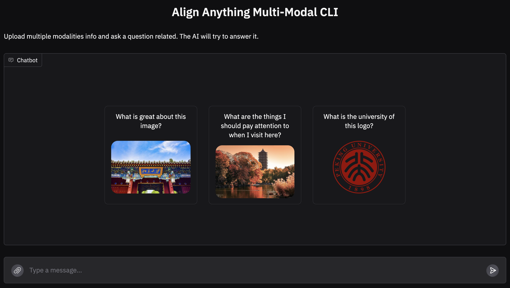

<!-- markdownlint-disable first-line-h1 -->
<!-- markdownlint-disable html -->

<div align="center">
  
  <div>&nbsp;</div>
  <div align="center">
    <b><font size="5">project website</font></b>
    <sup>
      <a href="https://space.bilibili.com/3493095748405551?spm_id_from=333.337.search-card.all.click">
        <i><font size="4">HOT</font></i>
      </a>
    </sup>
    &nbsp;&nbsp;&nbsp;&nbsp;
    <b><font size="5">PKU-Alignment Team</font></b>
    <sup>
      <a href="https://space.bilibili.com/3493095748405551?spm_id_from=333.337.search-card.all.click">
        <i><font size="4">welcome</font></i>
      </a>
    </sup>
  </div>
  <div>&nbsp;</div>


[](https://pypi.org/project/align-anything)
[](#license)

[📘Documentation](https://align-anything.readthedocs.io/) |
[🛠️Quick Start](#quick-start) |
[🚀Algorithms](#algorithms) |
[👀Evaluation](#evaluation) |
[🤔Reporting Issues](#report-issues)
</div>

<div align="center">


[Our All-Modality Alignment Datasets](https://huggingface.co/datasets/PKU-Alignment/align-anything)

</div>

Align-Anything aims to align any modality large models (any-to-any models), including LLMs, VLMs, and others, with human intentions and values. More details about the definition and milestones of alignment for Large Models can be found in [AI Alignment](https://alignmentsurvey.com). Overall, this framework has the following characteristics:

- **Highly Modular Framework.** Its versatility stems from the abstraction of different algorithm types and well-designed APIs, allowing users to easily modify and customize the code for different tasks (see [framework design](https://align-anything.readthedocs.io/)).
- **Various Modality Model Fine-Tuning.** Fine-tuning capabilities for models such as LLaMA3.2, LLaVA, Gemma, Qwen2Audio, Chameleon, and others (see [Model Zoo](#advanced-usage)).
- **Different Alignment Methods.** Different alignment algorithms, including SFT, DPO, PPO, and others (see [scripts](./scripts)).
- **Multi-Modal CLI.** Multi-modal CLI for image, audio, and video modalities (see [multi-modal CLI](#multi-modal-cli)).
- **O1-like Training.** O1-like training based on [DollyTails](https://huggingface.co/datasets/PKU-Alignment/DollyTails-12K) (see [scripts/llama_sft_o1.sh](./scripts)).

**Note:** We provide a [quick start guide](https://align-anything.readthedocs.io/) for users to quickly get the code structure and development details.


## 📣 News

* **`Coming Soon`** ⚡️⚡️⚡️ We plan to separate the evaluation component from align-anything and establish eval-anything as a dedicated repository for large-scale evaluation of any-to-any models. Meanwhile, align-anything will remain focused on the post-training alignment of any-to-any models.

* **[2025.03.15]** 📜📜📜 We release the tutorial for extending modality from `text-to-text` to `text-image-to-text` models. Check out the [cookbook_en](./cookbooks/en/modality_scaling.ipynb) (for English) and [cookbook_zh](./cookbooks/zh/modality_scaling.ipynb) (for Chinese).

  > We will release other tutorials in the future. Stay tuned! 😊

* **[2025.03.15]**  We have supported seamless migration to Slurm clusters! Check out our example [here](#training-on-slurm) to get started.

* **[2025.03.14]** 🛠️🛠️🛠️ We have supported Safe RLHF-V for `Text + Image -> Text` modality models.

* **[2025.03.12]** 🛠️🛠️🛠️ We have supported resume training for DPO and SFT, see [here](https://github.com/PKU-Alignment/align-anything/pull/153).

* **[2025.03.11]** 🎉🎉🎉 We support the installation of **Huawei Ascend** dependencies through pre-set Docker image.

* **[2025.03.02]** 🎉🎉🎉 We have implemented alignment training for Vision-Language-Action Models in embodied intelligence, see [VLA Trainer](https://github.com/PKU-Alignment/align-anything/tree/main/align_anything/trainers/text_video_to_action), with more features coming soon!

* **[2025.02.28]** 🤝🤝🤝 We supported the training and inference of align-anything on Huawei Ascend NPU.

  >  近期align-anything团队正在和华为昇腾团队积极联合开发，基于VLLMs-Ascend上的全模态推理和对齐微调。

* **[2025.02.28]** 🤗🤗🤗 We open-sourced [🤗Align-DS-V](https://huggingface.co/PKU-Alignment/Align-DS-V), an experimental vision-language model based on [DeepSeek-R1-Distill-Llama-8B](https://github.com/deepseek-ai/DeepSeek-R1), which enhances reasoning by incorporating additional modalities into the language model. The model has already surpassed **18,000+** downloads!

* **[2025.02.28]** We supported the alignment fine-tuning of DeepSeek’s Unified Multimodal Understanding and Generation Models, as well as the SFT and DPO of the [**Janus-Series**](https://github.com/deepseek-ai/Janus). You can find the examples in the `./scripts` and `./projects/janus` directory.

* **[2025.02.19]** We supported the alignment methods **GRPO** used in DeepSeek R1. See [GRPO Trainer](https://github.com/PKU-Alignment/align-anything/blob/main/align_anything/trainers/text_to_text/grpo.py).

* **[2025.01.21]** We supported the alignment fine-tuning of **MiniCPM-o** (audio & image), also included in [the official repository’s README recommendations](https://github.com/OpenBMB/MiniCPM-o#with-align-anything-).

* **[2025.01.17]** 🔥🔥🔥 We supported the fine-tuning of **O1-like reasoning in the text2text modality** (see [DollyTails](https://huggingface.co/datasets/PKU-Alignment/DollyTails-12K)), with multimodal and additional modalities coming soon!

* **[2024.11.20]** We release a bunch of scripts for all-modality models [here](./scripts). You can directly run the scripts to fine-tune your models, without any need to modify the code.

* **[2024.10.11]** We supported the alignment fine-tuning of the latest **Emu3** model.

* **[2024.10.10]** We contributed to the evaluation of new modalities, particularly the performance assessment of text-video-to-text models.

* **[2024.08.29]** 💡💡💡 We supported learning from language feedback (different from binary feedback). For more details, see [lang-feedback](https://github.com/PKU-Alignment/align-anything/tree/main/projects/lang_feedback).
<details><summary>More News</summary>

* **[2024.10.10]** We support SFT for `Any -> Any` modality models Emu3.
* **[2024.09.24]** We support SFT, DPO, RM and PPO for `Text + Video -> Text` modality models.
* **[2024.09.13]** We support SFT, DPO, RM and PPO for `Text + Audio -> Text` modality models.
* **[2024.08.17]** We support DPO and PPO for `Text+Image -> Text+Image` modality models.
* **[2024.08.15]** We support a new function in the evaluation module: the `models_pk` script in [here](./scripts/models_pk.sh), which enables comparing the performance of two models across different benchmarks.
* **[2024.08.06]** We restructure the framework to support any modality evaluation and the supported benchmark list is [here](https://github.com/PKU-Alignment/align-anything/tree/main/align_anything/evaluation/benchmarks).
* **[2024.08.06]** We support `Text+Image -> Text+Image` modality for the SFT trainer and Chameleon models.
* **[2024.07.23]** We support `Text -> Image`, `Text -> Audio`, and `Text -> Video` modalities for the SFT trainer and DPO trainer.
* **[2024.07.22]** We support the **Chameleon** model for the SFT trainer and DPO trainer!
* **[2024.07.17]** We open-source the Align-Anything-Instruction-100K dataset for text modality. This dataset is available in both [English](https://huggingface.co/datasets/PKU-Alignment/Align-Anything-Instruction-100K) and [Chinese](https://huggingface.co/datasets/PKU-Alignment/Align-Anything-Instruction-100K-zh) versions, each sourced from different data sets and meticulously refined for quality by GPT-4.
* **[2024.07.14]** We open-source the align-anything framework.

</details>

<details><summary>More News</summary>


* **[2024.10.10]** We support SFT for `Any -> Any` modality models Emu3.
* **[2024.09.24]** We support SFT, DPO, RM and PPO for `Text + Video -> Text` modality models.
* **[2024.09.13]** We support SFT, DPO, RM and PPO for `Text + Audio -> Text` modality models.
* **[2024.08.17]** We support DPO and PPO for `Text+Image -> Text+Image` modality models.
* **[2024.08.15]** We support a new function in the evaluation module: the `models_pk` script in [here](./scripts/models_pk.sh), which enables comparing the performance of two models across different benchmarks.
* **[2024.08.06]** We restructure the framework to support any modality evaluation and the supported benchmark list is [here](https://github.com/PKU-Alignment/align-anything/tree/main/align_anything/evaluation/benchmarks).
* **[2024.08.06]** We support `Text+Image -> Text+Image` modality for the SFT trainer and Chameleon models.
* **[2024.07.23]** We support `Text -> Image`, `Text -> Audio`, and `Text -> Video` modalities for the SFT trainer and DPO trainer.
* **[2024.07.22]** We support the **Chameleon** model for the SFT trainer and DPO trainer!
* **[2024.07.17]** We open-source the Align-Anything-Instruction-100K dataset for text modality. This dataset is available in both [English](https://huggingface.co/datasets/PKU-Alignment/Align-Anything-Instruction-100K) and [Chinese](https://huggingface.co/datasets/PKU-Alignment/Align-Anything-Instruction-100K-zh) versions, each sourced from different data sets and meticulously refined for quality by GPT-4.
* **[2024.07.14]** We open-source the align-anything framework.

</details>

## Quick Start

### Easy Installation

```bash
# clone the repository
git clone git@github.com:PKU-Alignment/align-anything.git
cd align-anything

# create virtual env
conda create -n align-anything python==3.11
conda activate align-anything
```

- **`[Optional]`** We recommend installing [CUDA](https://anaconda.org/nvidia/cuda) in the conda environment and set the environment variable.

```bash
# We tested on the H800 computing cluster, and this version of CUDA works well.
# You can adjust this version according to the actual situation of the computing cluster.

conda install nvidia/label/cuda-12.2.0::cuda
export CUDA_HOME=$CONDA_PREFIX
```

> If your CUDA installed in a different location, such as `/usr/local/cuda/bin/nvcc`, you can set the environment variables as follows:

```bash
export CUDA_HOME="/usr/local/cuda"
```

Finally, install `align-anything` by:

```bash
# We prepare quick installation for training and evaluation.
# If you only need to use the training or evaluation module,
# you can install the corresponding dependencies.
pip install -e .[train] # install the training dependencies
pip install -e .[evaluate] # install the evaluation dependencies

# If you need to install all dependencies, you can use the following command:
pip install -e .[all]
```

<details>
<summary>Other Dependencies</summary>


- `pip install -e .[text-to-audio]`: Install the text-to-audio dependencies.
- `pip install -e .[minicpmv]`: Install the minicpmv dependencies.
- `pip install -e .[minicpmo]`: Install the minicpmo dependencies.
- `pip install -e .[ascend]`: Install the ascend dependencies.

```
NOTE: The current test environment for Ascend is:
- Python 3.10.6
- CANN 8.0.rc3
- Architecture: aarch64
- Hardware: 8x Ascend-SNT9B ARM (192 cores, 1536GB memory)
```

<details>
  <summary>Install ascend dependencies using our docker image</summary>


  1. **Current Ascend Machine Environment Configuration**
     The current environment configuration for the Ascend Machine is as follows:

     ```
     - Python version: 3.10.6
     - CANN version: 8.0.rc3
     - Architecture: aarch64
     - Hardware: 8x Ascend-SNT9B ARM (192 cores, 1536GB memory)
     - Ascend Driver Version: 23.0.7
     - AscendHAL Version: 7.35.19
     - AICPU Version: 1.0
     - TDT Version: 1.0
     - Log Version: 1.0
     - Profiler Version: 2.0
     - DVPP Kernels Version: 1.1
     - TSFW Version: 1.0
     - Inner Version: V100R001C15SPC012B220
     - Compatible Versions: V100R001C30, V100R001C13, V100R001C15
     - Compatible Firmware Versions: [7.0.0, 7.1.99]
     - Package Version: 23.0.7
     ```

  2. **Create the Docker Container**
     To get started with the pre-configured environment, you can use the `setup_docker.sh` script located in the `./scripts` directory to pull the Docker image and create a container with all necessary environments set up:

       ```
       cd scripts
       bash setup_docker.sh
       ```

     This will automatically pull the Docker image and create a Docker container where all the dependencies and configurations for running the framework are already set up.

  3. **Warning**
     **Environment Compatibility**: The environment mentioned above is tested and verified to work. If you attempt to run the setup on other environments, you may encounter issues. In such cases, you will need to perform debugging and adjustments yourself to ensure compatibility with your specific environment.

</details>

</details>


### Training

We provide some scripts for quick start, you can find them in the `./scripts` directory. These scripts would automatically download the model and dataset, and run the training or evaluation.

For example, `scripts/llava/llava_dpo.sh` is the script for `Text + Image -> Text` modality, you can run it by:

```bash
cd scripts
bash llava/llava_dpo.sh
```


#### Training on Slurm
> We fully support seamless migration to Slurm. If you plan to run training on a Slurm-managed cluster, we invite you to use our example Slurm training script:
>```bash
>cd scripts
>bash slurm/slurm_llava_dpo.sh
>```
>This script is pre-configured with suitable Slurm parameters. You only need to adjust the settings (such as the `job name`, `partition`, `account`, `path` and `resource allocations`) to match your cluster configuration.
### Evaluation

After training, you can evaluate the model by running the `scripts/evaluation/llava_eval.sh` script.

```bash
cd scripts
bash evaluation/llava_eval.sh
```

You can simply modify the parameters in the script to suit your needs, *e.g.*, the `MODEL_NAME_OR_PATH` for your own model or `TRAIN_DATASETS` for your own dataset. For more details please refer to the [Advanced Usage](#advanced-usage) section.

## Algorithms

We support basic alignment algorithms for different modalities, each of which may involve additional algorithms. For instance, in the text modality, we have also implemented SimPO, KTO, and others.

| Modality                           | SFT  | RM   | DPO  | PPO  |
| ---------------------------------- | ---- | ---- | ---- | ---- |
| `Text -> Text (t2t)`               | ✔️    | ✔️    | ✔️    | ✔️    |
| `Text+Image -> Text (ti2t)`        | ✔️    | ✔️    | ✔️    | ✔️    |
| `Text+Image -> Text+Image (ti2ti)` | ✔️    | ✔️    | ✔️    | ✔️    |
| `Text+Audio -> Text (ta2t)`        | ✔️    | ✔️    | ✔️    | ✔️    |
| `Text+Video -> Text (tv2t)`        | ✔️    | ✔️    | ✔️    | ✔️    |
| `Text -> Image (t2i)`              | ✔️    | ⚒️    | ✔️    | ⚒️    |
| `Text -> Video (t2v)`              | ✔️    | ⚒️    | ✔️    | ⚒️    |
| `Text -> Audio (t2a)`              | ✔️    | ⚒️    | ✔️    | ⚒️    |
| `Text+Video -> Action (tv2act)`    | ✔️    | ⚒️    | ⚒️    | ⚒️    |

## Evaluation

We support evaluation datasets for `Text -> Text`, `Text+Image -> Text` and `Text -> Image`.

| Modality | Supported Benchmarks                                         |
| :------- | :----------------------------------------------------------- |
| `t2t`    | [ARC](https://huggingface.co/datasets/allenai/ai2_arc), [BBH](https://huggingface.co/datasets/lukaemon/bbh), [Belebele](https://huggingface.co/datasets/facebook/belebele), [CMMLU](https://huggingface.co/datasets/haonan-li/cmmlu), [GSM8K](https://huggingface.co/datasets/openai/gsm8k), [HumanEval](https://huggingface.co/datasets/openai/openai_humaneval), [MMLU](https://huggingface.co/datasets/cais/mmlu), [MMLU-Pro](https://huggingface.co/datasets/TIGER-Lab/MMLU-Pro), [MT-Bench](https://huggingface.co/datasets/HuggingFaceH4/mt_bench_prompts), [PAWS-X](https://huggingface.co/datasets/google-research-datasets/paws-x), [RACE](https://huggingface.co/datasets/ehovy/race), [TruthfulQA ](https://huggingface.co/datasets/truthfulqa/truthful_qa) |
| `ti2t`   | [A-OKVQA](https://huggingface.co/datasets/HuggingFaceM4/A-OKVQA), [LLaVA-Bench(COCO)](https://huggingface.co/datasets/lmms-lab/llava-bench-coco), [LLaVA-Bench(wild)](https://huggingface.co/datasets/lmms-lab/llava-bench-in-the-wild), [MathVista](https://huggingface.co/datasets/AI4Math/MathVista), [MM-SafetyBench](https://huggingface.co/datasets/PKU-Alignment/MM-SafetyBench), [MMBench](https://huggingface.co/datasets/lmms-lab/MMBench), [MME](https://huggingface.co/datasets/lmms-lab/MME), [MMMU](https://huggingface.co/datasets/MMMU/MMMU), [MMStar](https://huggingface.co/datasets/Lin-Chen/MMStar), [MMVet](https://huggingface.co/datasets/lmms-lab/MMVet), [POPE](https://huggingface.co/datasets/lmms-lab/POPE), [ScienceQA](https://huggingface.co/datasets/derek-thomas/ScienceQA), [SPA-VL](https://huggingface.co/datasets/sqrti/SPA-VL), [TextVQA](https://huggingface.co/datasets/lmms-lab/textvqa), [VizWizVQA](https://huggingface.co/datasets/lmms-lab/VizWiz-VQA) |
| `tv2t`   | [MVBench](https://huggingface.co/datasets/OpenGVLab/MVBench), [Video-MME](https://huggingface.co/datasets/lmms-lab/Video-MME) |
| `ta2t`   | [AIR-Bench](https://huggingface.co/datasets/qyang1021/AIR-Bench-Dataset) |
| `t2i`    | [ImageReward](https://huggingface.co/datasets/THUDM/ImageRewardDB), [HPSv2](https://huggingface.co/datasets/zhwang/HPDv2), [COCO-30k(FID)](https://huggingface.co/datasets/sayakpaul/coco-30-val-2014) |
| `t2v`    | [ChronoMagic-Bench](https://huggingface.co/datasets/BestWishYsh/ChronoMagic-Bench) |
| `t2a`    | [AudioCaps(FAD)](https://huggingface.co/datasets/AudioLLMs/audiocaps_test) |
| `tv2act` | ⚒️                                                            |

- ⚒️ : coming soon.


## Wandb Logger

We support `wandb` logging. By default, it is set to offline. If you need to view wandb logs online, you can specify the environment variables of `WANDB_API_KEY` before starting the training:

```bash
export WANDB_API_KEY="..."  # your W&B API key here
```

## Advanced Usage

### Training

**Q (Training Model Registration):** What models are supported for training? What should I pay attention to if I want to use my own model?

*A:* The models registration of align-anything is 2 folds:

1. The model has been manually supported by the align-anything team, they are:

| Modality                   | Models                                                       |
| -------------------------- | ------------------------------------------------------------ |
| `Text -> Text`             | [meta-llama/Llama-3.1-8B-Instruct series](https://huggingface.co/meta-llama/Llama-3.1-8B-Instruct) (Llama3, Llama2 is also supported) |
| `Text+Image -> Text`       | [LLaVA series](https://huggingface.co/collections/llava-hf/llava-15-65f762d5b6941db5c2ba07e0), [LLaVA-Next series](https://huggingface.co/collections/llava-hf/llava-next-65f75c4afac77fd37dbbe6cf), [openbmb/MiniCPM-V](https://huggingface.co/openbmb/MiniCPM-V/tree/main) and [LLaMA-3.2-Vision-Instruct](https://huggingface.co/meta-llama/Llama-3.2-11B-Vision-Instruct) |
| `Text+Image -> Text+Image` | [facebook/chameleon-7b](https://huggingface.co/facebook/chameleon-7b) |
| `Text+Audio -> Text`       | [Qwen/Qwen2-Audio-7B-Instruct](https://huggingface.co/Qwen/Qwen2-Audio-7B-Instruct) |
| `Text+Video -> Text`       | [Qwen/Qwen2-VL-7B-Instruct](https://huggingface.co/Qwen/Qwen2-VL-7B-Instruct) |
| `Text -> Image`            | [CompVis/stable-diffusion-v1-4](https://huggingface.co/CompVis/stable-diffusion-v1-4) |
| `Text -> Video`            | [ali-vilab/text-to-video-ms-1.7b](https://huggingface.co/ali-vilab/text-to-video-ms-1.7b) |
| `Text -> Audio`            | [cvssp/audioldm-s-full-v2](https://huggingface.co/cvssp/audioldm-s-full-v2) |

Besides, you can also use your own model for training, you can refer to the here (sorry, corresponding docs will be uploaded later) for the model registration.

**Q (Training Dataset Registration):** What datasets are supported for training? What should I pay attention to if I want to use my own dataset?

*A:* We prepare `datasets_formatter` for dataset registration. Its core function is to mapping the dataset key to conversation format.

Basically, we support 3 types of dataset format:

| Type                        | Description                                                  |
| --------------------------- | ------------------------------------------------------------ |
| `format_supervised_sample`  | Mapping the dataset to the supervised training format (For SFT). |
| `format_preference_sample`  | Mapping the dataset to the preference training format (For RM, DPO, KTO, *etc.*). |
| `format_prompt_only_sample` | Mapping the dataset to the unique prompt only training format (For PPO). |

We introduce the following example below, and you can refer to [here](./align_anything/configs/format_dataset.py) for more details.


- `format_supervised_sample`:

<details>
<summary>Click to expand</summary>


```python
@register_template('Alpaca')
class Alpaca(BaseFormatter):

    def format_supervised_sample(self, raw_sample: dict[str, Any]) -> tuple[list[dict[str, Any]], dict]:
        prompt = ' '.join((raw_sample['instruction'], raw_sample['input']))
        response = raw_sample['output']
        return [
            {"role": "user", "content": prompt},
            {"role": "assistant", "content": response},
        ], {}
```

</details>

- `format_preference_sample`:

<details>
<summary>Click to expand</summary>


```python
@register_template('AA_TI2T')
class AA_TI2T(BaseFormatter):
    system_prompt: str = ""

    def format_preference_sample(self, raw_sample: dict[str, Any]) -> tuple[list[dict[str, Any]], list[dict[str, Any]], dict[str, Any]]:
        better_id = int(raw_sample['overall_response'])
        worse_id = 2 if better_id==1 else 1

        if better_id not in [1, 2] or worse_id not in [1, 2]:
            return [], [], {}

        raw_better_response = raw_sample[f'response_{better_id}']
        raw_worse_response = raw_sample[f'response_{worse_id}']
        prompt = raw_sample['question']
        image = raw_sample['image'].convert('RGBA')
        better_conversation = [
            {'role': 'user', 'content': [
                    {'type': 'image'},
                    {'type': 'text', 'text': prompt},
                ]
            },
            {'role': 'assistant', 'content': [{'type': 'text', 'text': raw_better_response}]},
        ]
        worse_conversation = [
            {'role': 'user', 'content': [
                    {'type': 'image'},
                    {'type': 'text', 'text': prompt},
                ]
            },
            {'role': 'assistant', 'content': [{'type': 'text', 'text': raw_worse_response}]},
        ]

        meta_info = {
            'image': image,
            'better_response': raw_better_response,
            'worse_response': raw_worse_response,
        }

        return better_conversation, worse_conversation, meta_info
```

</details>

- `format_prompt_only_sample`:

<details>
<summary>Click to expand</summary>


```python
@register_template('AA_TA2T')
class AA_TA2T(BaseFormatter):
    system_prompt: str = 'You are a helpful assistant.'

    def format_prompt_only_sample(self, raw_sample: dict[str, Any]) -> dict[str, Any]:
        prompt = raw_sample['prompt']
        audio_path = raw_sample['audio_path']

        conversation = [
            {'role': 'system', 'content': [{'type': 'text', 'text': self.system_prompt}]},
            {'role': 'user', 'content': [
                    {'type': 'audio', 'audio_url': audio_path},
                    {'type': 'text', 'text': prompt},
                ]},
        ]

        return conversation, {'audio_path': audio_path}
```

</details>

### Evaluation

**Q (Evaluation Model Registration):** What models are supported for evaluation? What should I pay attention to if I want to use my own model?

*A:* Register your model to use align-anything for evaluation is easy, you only need to add your model special token to the `./align_anything/configs/eval_template.py` file.

For example, if you want to use [liuhaotian/llava-v1.5-7b](https://huggingface.co/liuhaotian/llava-v1.5-7b) for evaluation, you need to add the following template for it to the `./align_anything/configs/eval_template.py` file:

```python
@register_template('Llava')
class Llava:
    system_prompt: str = ''
    user_prompt: str = 'USER: \n<image>{input}'
    assistant_prompt: str = '\nASSISTANT:{output}'
    split_token: str = 'ASSISTANT:'
    separator: str = '###'
```

### Evaluation

All evaluation scripts can be found in the `./scripts`. The `./scripts/evaluate.sh` script runs model evaluation on the benchmarks, and parameters that require user input have been left empty. The corresponding script is as follow:

You can modify the configuration files for the benchmarks in [this directory](https://github.com/PKU-Alignment/align-anything/tree/main/align_anything/configs/evaluation/benchmarks) to suit specific evaluation tasks and models, and adjust inference parameters for [vLLM](https://github.com/PKU-Alignment/align-anything/tree/main/align_anything/configs/evaluation/vllm) or [DeepSpeed](https://github.com/PKU-Alignment/align-anything/tree/main/align_anything/configs/evaluation/deepspeed) based on your generation backend. For more details about the evaluation pipeline, refer to the [here](https://github.com/PKU-Alignment/align-anything/blob/main/align_anything/evaluation/README.md).

## Inference

### Multi-Modal CLI

```bash
# Omni-modal inference
python3 -m align_anything.serve.omni_modal_cli --model_name_or_path openbmb/MiniCPM-o-2_6

# Image inference
python3 -m align_anything.serve.multi_modal_cli --model_name_or_path llava-hf/llava-1.5-7b-hf --modality image

# Audio inference
python3 -m align_anything.serve.multi_modal_cli --model_name_or_path Qwen/Qwen2-Audio-7B-Instruct --modality audio

# Video inference
python3 -m align_anything.serve.multi_modal_cli --model_name_or_path llava-hf/LLaVA-NeXT-Video-7B-hf --modality video
```




### Interactive Client

```bash
python3 -m align_anything.serve.cli --model_name_or_path your_model_name_or_path
```


### Interactive Arena

```bash
python3 -m align_anything.serve.arena \
    --red_corner_model_name_or_path your_red_model_name_or_path \
    --blue_corner_model_name_or_path your_blue_model_name_or_path
```


## New Feature: Align VLA

|              | <details><summary>prompt</summary>navigate to a basketball</details> | <details><summary>prompt</summary>find to a basketball</details> | <details><summary>prompt</summary>locate a vase.</details>   | <details><summary>prompt</summary>find a spray bottle and pick up that spray bottle</details> |
| ------------ | ------------------------------------------------------------ | ------------------------------------------------------------ | ------------------------------------------------------------ | ------------------------------------------------------------ |
| Baseline     |  |  |  |  |
| **AlignVLA** |  |  |  |  |

> Alignment fine-tuning can significantly enhance the security performance of the VLA model.

### Downloading the training data

```bash
python -m align_anything.trainers.text_video_to_action.download_training_data --save_dir ./path/to/your/data  --types astar
```

Then decompress the compressed data package.

### Training

modify ``HOME_PREFIX`` in ``align-anything/scripts/il_training.sh`` to your local data path.

```bash
bash scripts/vla/il_training.sh
```

More details on [AlignVLA](align_anything/trainers/text_video_to_action/README.md)


## Citation

Please cite the repo if you find the data or code in this repo useful 😊

```bibtex
@inproceedings{ji2024align,
  title={Align Anything: Training All-Modality Models to Follow Instructions with Language Feedback},
  author={Jiaming Ji and Jiayi Zhou and Hantao Lou and Boyuan Chen and Donghai Hong and Xuyao Wang and Wenqi Chen and Kaile Wang and Rui Pan and Jiahao Li and Mohan Wang and Josef Dai and Tianyi Qiu and Hua Xu and Dong Li and Weipeng Chen and Jun Song and Bo Zheng and Yaodong Yang},
  year={2024},
  url={https://arxiv.org/abs/2412.15838}
}
```


## Report Issues

If you have any questions in the process of using align-anything, don't hesitate to ask your questions on [the GitHub issue page](https://github.com/PKU-Alignment/align-anything/issues/new/choose), we will reply to you in 2-3 working days.

# License

align-anything is released under Apache License 2.0.
