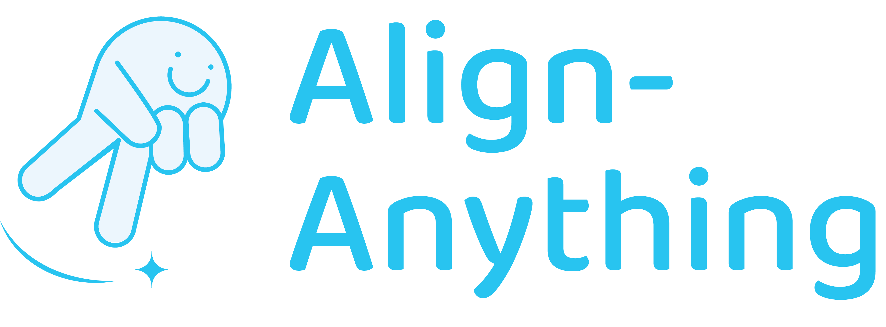
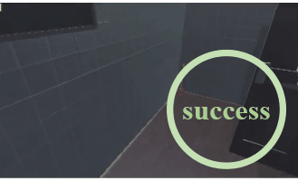
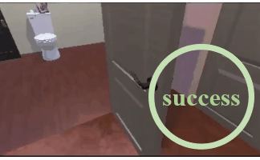

<!-- markdownlint-disable first-line-h1 -->
<!-- markdownlint-disable html -->

<div align="center">
  
  <div>&nbsp;</div>
  <div align="center">
    <b><font size="5">project website</font></b>
    <sup>
      <a href="https://space.bilibili.com/3493095748405551?spm_id_from=333.337.search-card.all.click">
        <i><font size="4">HOT</font></i>
      </a>
    </sup>
    &nbsp;&nbsp;&nbsp;&nbsp;
    <b><font size="5">PKU-Alignment Team</font></b>
    <sup>
      <a href="https://space.bilibili.com/3493095748405551?spm_id_from=333.337.search-card.all.click">
        <i><font size="4">welcome</font></i>
      </a>
    </sup>
  </div>
  <div>&nbsp;</div>

[](https://pypi.org/project/align-anything)
[](#license)

[📘Documentation](https://align-anything.readthedocs.io/) |
[🛠️Quick Start](#quick-start) |
[🚀Algorithms](#algorithms) |
[👀Evaluation](#evaluation) |
[🤔Reporting Issues](#report-issues)

</div>

<div align="center">

[Our All-Modality Alignment Datasets](https://huggingface.co/datasets/PKU-Alignment/align-anything)

</div>

Align-Anything aims to align any modality large models (any-to-any models) with human intentions and values. 

- **Highly Modular Framework** allowing users to easily modify and customize the code for different tasks (see [framework design](https://align-anything.readthedocs.io/)).
- **Various Modality Model Fine-Tuning** for diverse multi-modal (image/video/audio) models (see [scripts](./scripts)).
- **Different Alignment Methods.** Different alignment algorithms, including SFT, DPO, PPO, and others.
- **Multi-Modal CLI.** Multi-modal CLI for image, audio, and video modalities (see [multi-modal CLI](#multi-modal-cli)).
- **O1-like Training.** O1-like training based on [DollyTails](https://huggingface.co/datasets/PKU-Alignment/DollyTails-12K) (see [scripts/llama_sft_o1.sh](./scripts)).
- **Rule-based RL.** Rule-based RL encouraged by [Deepseek-R1](https://huggingface.co/deepseek-ai/DeepSeek-R1).

**Note:** We provide a [quick start guide](https://align-anything.readthedocs.io/) for users to quickly get the code structure and development details.

## 📣 News

- **[Future]** ⚡️⚡️⚡️ We will integrate more cutting-edge MLLMs into our framework and develop our VLA part. Stay tuned!

- **[2025.04.14]** 📜📜📜 We release the tutorial on SFT training for `text-image-to-text` models. Check out the [cookbook_en](./cookbooks/en/text_image_to_text_sft.ipynb) (for English) and [cookbook_zh](./cookbooks/zh/text_image_to_text_sft.ipynb) (for Chinese).

- **[2025.04.07]** 🥳🥳🥳 Align-Anything now serves as the homework platform for the PKU course [Large Language Models Basics and Alignment](https://pku-llm.ai/), supporting on both Nvidia GPU and Huawei Ascend NPU. The corresponding tutorial will be released soon!

> Align-Anything目前已成为北京大学本硕博课程《大模型基础与对齐》的课程作业平台，支持在Nvidia GPU和华为昇腾NPU上进行训练与评估。对应教程将持续发布！

- **[2025.03.31]** ✅✅✅ We enhance the installation process for both Nvidia GPU and Huawei Ascend NPU. Please refer to the [Quick Start](#quick-start) for details.

- **[2025.03.31]** 🛠️🛠️🛠️ We separate the evaluation component from align-anything and establish [eval-anything](https://github.com/PKU-Alignment/eval-anything) as a dedicated repository for large-scale evaluation of any-to-any models.

- **[2025.03.31]** 🚀🚀🚀 We support wrapping the `actor` model with [vLLM engine](https://github.com/vllm-project/vllm) for sequence generation in `text-to-text ppo` training. It greatly accelerates the ppo training process. Our results show that with vLLM engine, it only takes 22 minutes to finish ppo, while the baseline case needs ~150 minutes.

    > 😊 Our implementation is encouraged by [OpenRLHF](https://github.com/OpenRLHF/OpenRLHF), which is a great project for RLHF training.

- **[2025.03.27]** 📜📜📜 We release the tutorial on DPO training for `text-to-text` models. Check out the [cookbook_en](./cookbooks/en/text_to_text_dpo.ipynb) (for English) and [cookbook_zh](./cookbooks/zh/text_to_text_dpo.ipynb) (for Chinese).

- **[2025.03.15]** 📜📜📜 We release the tutorial for extending modality from `text-to-text` to `text-image-to-text` models. Check out the [cookbook_en](./cookbooks/en/modality_scaling.ipynb) (for English) and [cookbook_zh](./cookbooks/zh/modality_scaling.ipynb) (for Chinese).

  > We will release other tutorials in the future. Stay tuned! 😊

- **[2025.03.15]** We have supported seamless migration to Slurm clusters! Check out our example [here](#training-on-slurm) to get started.

- **[2025.03.14]** 🛠️🛠️🛠️ We have supported Safe RLHF-V for `Text + Image -> Text` modality models.

- **[2025.03.12]** 🛠️🛠️🛠️ We have supported resume training for DPO and SFT, see [here](https://github.com/PKU-Alignment/align-anything/pull/153).

- **[2025.03.11]** 🎉🎉🎉 We support the installation of **Huawei Ascend** dependencies through pre-set Docker image.

- **[2025.03.02]** 🎉🎉🎉 We have implemented alignment training for Vision-Language-Action Models in embodied intelligence, see [VLA Trainer](https://github.com/PKU-Alignment/align-anything/tree/main/align_anything/trainers/text_video_to_action), with more features coming soon!

- **[2025.02.28]** 🤝🤝🤝 We supported the training and inference of align-anything on Huawei Ascend NPU.

  > 近期 align-anything 团队正在和华为昇腾团队积极联合开发，基于 VLLMs-Ascend 上的全模态推理和对齐微调。


<details><summary>More News</summary>

- **[2025.02.28]** 🤗🤗🤗 We open-sourced [🤗Align-DS-V](https://huggingface.co/PKU-Alignment/Align-DS-V), an experimental vision-language model based on [DeepSeek-R1-Distill-Llama-8B](https://github.com/deepseek-ai/DeepSeek-R1), which enhances reasoning by incorporating additional modalities into the language model. The model has already surpassed **18,000+** downloads!
- **[2025.02.28]** We supported the alignment fine-tuning of DeepSeek’s Unified Multimodal Understanding and Generation Models, as well as the SFT and DPO of the [**Janus-Series**](https://github.com/deepseek-ai/Janus). You can find the examples in the `./scripts` and `./projects/janus` directories.
- **[2025.02.19]** We supported the alignment methods **GRPO** used in DeepSeek R1. See [GRPO Trainer](https://github.com/PKU-Alignment/align-anything/blob/main/align_anything/trainers/text_to_text/grpo.py).
- **[2025.01.21]** We supported the alignment fine-tuning of **MiniCPM-o** (audio & image), also included in [the official repository’s README recommendations](https://github.com/OpenBMB/MiniCPM-o#with-align-anything-).
- **[2025.01.17]** 🔥🔥🔥 We supported the fine-tuning of **O1-like reasoning in the text2text modality** (see [DollyTails](https://huggingface.co/datasets/PKU-Alignment/DollyTails-12K)), with multimodal and additional modalities coming soon!
- **[2024.10.11]** We supported the alignment fine-tuning of the latest **Emu3** model.
- **[2024.08.29]** 💡💡💡 We supported learning from language feedback (different from binary feedback). For more details, see [lang-feedback](https://github.com/PKU-Alignment/align-anything/tree/main/projects/lang_feedback).
- **[2024.10.10]** We support SFT for `Any -> Any` modality models Emu3.
- **[2024.09.24]** We support SFT, DPO, RM and PPO for `Text + Video -> Text` modality models.
- **[2024.09.13]** We support SFT, DPO, RM and PPO for `Text + Audio -> Text` modality models.
- **[2024.08.17]** We support DPO and PPO for `Text+Image -> Text+Image` modality models.
- **[2024.08.15]** We support a new function in the evaluation module: the `models_pk` script in [here](./scripts/models_pk.sh), which enables comparing the performance of two models across different benchmarks.
- **[2024.08.06]** We restructure the framework to support any modality evaluation and the supported benchmark list is [here](https://github.com/PKU-Alignment/align-anything/tree/main/align_anything/evaluation/benchmarks).
- **[2024.08.06]** We support `Text+Image -> Text+Image` modality for the SFT trainer and Chameleon models.
- **[2024.07.23]** We support `Text -> Image`, `Text -> Audio`, and `Text -> Video` modalities for the SFT trainer and DPO trainer.
- **[2024.07.22]** We support the **Chameleon** model for the SFT trainer and DPO trainer!
- **[2024.07.17]** We open-source the Align-Anything-Instruction-100K dataset for text modality. This dataset is available in both [English](https://huggingface.co/datasets/PKU-Alignment/Align-Anything-Instruction-100K) and [Chinese](https://huggingface.co/datasets/PKU-Alignment/Align-Anything-Instruction-100K-zh) versions, each sourced from different data sets and meticulously refined for quality by GPT-4.
- **[2024.07.14]** We open-source the align-anything framework.

</details>

## Quick Start

### Easy Installation

```bash
# clone the repository
git clone git@github.com:PKU-Alignment/align-anything.git
cd align-anything

# create virtual env
conda create -n align-anything python==3.11
conda activate align-anything
```

#### On Nvidia GPU

- **`[Optional]`** We recommend installing [CUDA](https://anaconda.org/nvidia/cuda) in the conda environment and set the environment variable.

```bash
# We tested on the H800 computing cluster, and this version of CUDA works well.
# You can adjust this version according to the actual situation of the computing cluster.

conda install nvidia/label/cuda-12.2.0::cuda
export CUDA_HOME=$CONDA_PREFIX
```

> If your CUDA installed in a different location, such as `/usr/local/cuda/bin/nvcc`, you can set the environment variables as follows:

```bash
export CUDA_HOME="/usr/local/cuda"
```

Finally, install `align-anything` by:

```bash
pip3 install -e .

pip3 install vllm==0.7.2 # to run ppo on vllm engine
```

#### On Huawei Ascend NPU

You can build on Huawei Ascend NPU by simply:

```bash
pip3 install -e .[ascend]
```

The current test environment for Ascend is:

- Python 3.10.6
- CANN 8.0.rc3
- Architecture: aarch64
- Hardware: 8x Ascend-SNT9B ARM (192 cores, 1536GB memory)

<details>
  <summary>[Optional] Install ascend dependencies using our docker image</summary>

1. **Current Ascend Machine Environment Configuration**
   The current environment configuration for the Ascend Machine is as follows:

   ```
   - Python version: 3.10.6
   - CANN version: 8.0.rc3
   - Architecture: aarch64
   - Hardware: 8x Ascend-SNT9B ARM (192 cores, 1536GB memory)
   - Ascend Driver Version: 23.0.7
   - AscendHAL Version: 7.35.19
   - AICPU Version: 1.0
   - TDT Version: 1.0
   - Log Version: 1.0
   - Profiler Version: 2.0
   - DVPP Kernels Version: 1.1
   - TSFW Version: 1.0
   - Inner Version: V100R001C15SPC012B220
   - Compatible Versions: V100R001C30, V100R001C13, V100R001C15
   - Compatible Firmware Versions: [7.0.0, 7.1.99]
   - Package Version: 23.0.7
   ```

2. **Create the Docker Container**
   To get started with the pre-configured environment, you can use the `setup_docker.sh` script located in the `./scripts` directory to pull the Docker image and create a container with all necessary environments set up:

   ```
   cd scripts
   bash setup_docker.sh
   ```

   This will automatically pull the Docker image and create a Docker container where all the dependencies and configurations for running the framework are already set up.

3. **Warning**
   **Environment Compatibility**: The environment mentioned above is tested and verified to work. If you attempt to run the setup on other environments, you may encounter issues. In such cases, you will need to perform debugging and adjustments yourself to ensure compatibility with your specific environment.

</details>


If you encounter any issues, please refer to the [FAQ](https://github.com/PKU-Alignment/align-anything/discussions/167) for solutions.

<details>
<summary>[Optional] Other Dependencies</summary>

- `pip install -e .[text-to-audio]`: Install the text-to-audio dependencies.
- `pip install -e .[minicpmv]`: Install the minicpmv dependencies.
- `pip install -e .[minicpmo]`: Install the minicpmo dependencies.

</details>

### Training

We provide some scripts for quick start, you can find them in the `./scripts` directory. These scripts would automatically download the model and dataset, and run the training or evaluation.

For example, `scripts/llava/llava_dpo.sh` is the script for `Text + Image -> Text` modality, you can run it by:

```bash
cd scripts
bash llava/llava_dpo.sh
```

**Note:** The scripts will automatically download the model and dataset from huggingface. If you are prohibited from the internet, please try to use the `HF Mirror`:

```bash
export HF_ENDPOINT=https://hf-mirror.com
```

#### Training on Slurm

> We fully support seamless migration to Slurm. If you plan to run training on a Slurm-managed cluster, we invite you to use our example Slurm training script:
>
> ```bash
> cd scripts
> bash slurm/slurm_llava_dpo.sh
> ```
>
> This script is pre-configured with suitable Slurm parameters. You only need to adjust the settings (such as the `job name`, `partition`, `account`, `path` and `resource allocations`) to match your cluster configuration.

## Algorithms

We support basic alignment algorithms for different modalities, each of which may involve additional algorithms. For instance, in the text modality, we have also implemented SimPO, KTO, and others.

| Modality                           | SFT | RM  | DPO | PPO |
| ---------------------------------- | --- | --- | --- | --- |
| `Text -> Text (t2t)`               | ✔️  | ✔️  | ✔️  | ✔️  |
| `Text+Image -> Text (ti2t)`        | ✔️  | ✔️  | ✔️  | ✔️  |
| `Text+Image -> Text+Image (ti2ti)` | ✔️  | ✔️  | ✔️  | ✔️  |
| `Text+Audio -> Text (ta2t)`        | ✔️  | ✔️  | ✔️  | ✔️  |
| `Text+Video -> Text (tv2t)`        | ✔️  | ✔️  | ✔️  | ✔️  |
| `Text -> Image (t2i)`              | ✔️  | ⚒️  | ✔️  | ⚒️  |
| `Text -> Video (t2v)`              | ✔️  | ⚒️  | ✔️  | ⚒️  |
| `Text -> Audio (t2a)`              | ✔️  | ⚒️  | ✔️  | ⚒️  |
| `Text+Video -> Action (tv2act)`    | ✔️  | ⚒️  | ⚒️  | ⚒️  |

## New Feature: Align VLA

|              | <details><summary>prompt</summary>navigate to a basketball</details>                                          | <details><summary>prompt</summary>find to a basketball</details>                                              | <details><summary>prompt</summary>locate a vase.</details>                                                    | <details><summary>prompt</summary>find a spray bottle and pick up that spray bottle</details>                 |
| ------------ | ------------------------------------------------------------------------------------------------------------- | ------------------------------------------------------------------------------------------------------------- | ------------------------------------------------------------------------------------------------------------- | ------------------------------------------------------------------------------------------------------------- |
| Baseline     |  |  |  |  |
| **AlignVLA** |   |   |   |   |

> Alignment fine-tuning can significantly enhance the security performance of the VLA model.

### Downloading the training data

```bash
python -m align_anything.utils.spoc_utils.download_training_data --save_dir /path/to/data  --types fifteen
```

Then decompress the compressed data package.

### Training


modify ``HOME_PREFIX`` in ``align-anything/scripts/vla/spoc_sft.sh`` to your local data path.


```bash
bash scripts/vla/spoc_sft.sh
```


## Citation

Please cite the repo if you find the data or code in this repo useful 😊

```bibtex
@inproceedings{ji2024align,
  title={Align Anything: Training All-Modality Models to Follow Instructions with Language Feedback},
  author={Jiaming Ji and Jiayi Zhou and Hantao Lou and Boyuan Chen and Donghai Hong and Xuyao Wang and Wenqi Chen and Kaile Wang and Rui Pan and Jiahao Li and Mohan Wang and Josef Dai and Tianyi Qiu and Hua Xu and Dong Li and Weipeng Chen and Jun Song and Bo Zheng and Yaodong Yang},
  year={2024},
  url={https://arxiv.org/abs/2412.15838}
}
```

## Report Issues

If you have any questions in the process of using align-anything, don't hesitate to ask your questions on [the GitHub issue page](https://github.com/PKU-Alignment/align-anything/issues/new/choose), we will reply to you in 2-3 working days.

# License

align-anything is released under Apache License 2.0.
