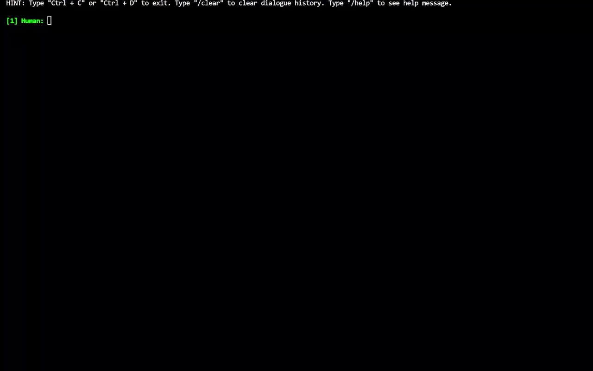

<!-- markdownlint-disable first-line-h1 -->
<!-- markdownlint-disable html -->

<div align="center">
  
  <div>&nbsp;</div>
  <div align="center">
    <b><font size="5">project website</font></b>
    <sup>
      <a href="https://space.bilibili.com/3493095748405551?spm_id_from=333.337.search-card.all.click">
        <i><font size="4">HOT</font></i>
      </a>
    </sup>
    &nbsp;&nbsp;&nbsp;&nbsp;
    <b><font size="5">PKU-Alignment Team</font></b>
    <sup>
      <a href="https://space.bilibili.com/3493095748405551?spm_id_from=333.337.search-card.all.click">
        <i><font size="4">welcome</font></i>
      </a>
    </sup>
  </div>
  <div>&nbsp;</div>

[](https://pypi.org/project/align-anything)
[](#license)

[📘Documentation](https://pku-alignment.notion.site/Align-Anything-37a300fb5f774bb08e5b21fdeb476c64) |
[🚀Features](#features) |
[🆕Update News](#news) |
[🛠️Installation](#installation) |
[👀Training](#train) |
[🤔Reporting Issues](#report-issues)
</div>

<div align="center">

[Our 100K Instruction-Following Datasets](https://huggingface.co/datasets/PKU-Alignment/Align-Anything-Instruction-100K)

</div>

Align-Anything aims to align any modality large models (any-to-any models), including LLMs, VLMs, and others, with human intentions and values. More details about the definition and milestones of alignment for Large Models can be found in [AI Alignment](https://alignmentsurvey.com). Overall, this framework has the following characteristics:

- **Highly Modular Framework.** Its versatility stems from the abstraction of different algorithm types and well-designed APIs, allowing users to easily modify and customize the code for different tasks.
- **Support for Various Model Fine-Tuning.** This framework includes fine-tuning capabilities for models such as LLaMA3.1, LLaVA, Gemma, Qwen, Baichuan, and others (see [Model Zoo](https://github.com/PKU-Alignment/align-anything/blob/main/Model-Zoo.md)).
- **Support Fine-Tuning across Any Modality.** It supports fine-tuning alignments for different modality model, including LLMs, VLMs, and other modalities (see [Development Roadmap](#development-roadmap)).
- **Support Different Alignment Methods.** The framework supports different alignment algorithms, including SFT, DPO, PPO, and others (see [Example](https://github.com/PKU-Alignment/align-anything/tree/main/examples)).


|| <details><summary>prompt</summary>Small white toilet sitting in a small corner next to a wall.</details> | <details><summary>prompt</summary>A close up of a neatly made bed with two night stands</details>  | <details><summary>prompt</summary>A pizza is sitting on a plate at a restaurant.</details> |<details><summary>prompt</summary>A girl in a dress next to a piece of luggage and flowers.</details>|
|---| ---------------------------------- | --- | --- | --- |
|Before Alignment ([Chameleon-7B](https://huggingface.co/facebook/chameleon-7b))|  |  |   | |
|**After Alignment ([Align-Anything Chameleon 7B Plus](https://huggingface.co/PKU-Alignment/AA-chameleon-7b-plus))**|  |  |   | |

> Alignment can significantly enhance the instruction-following capabilities of large multimodal models. After alignment, Chameleon 7B Plus generates images that are more relevant to the prompt.

## Algorithms
We support basic alignment algorithms for different modalities, each of which may involve additional algorithms. For instance, in the text modality, we have also implemented SimPO, KTO, and others.

| Modality                           | SFT | RM  | DPO | PPO |
| ---------------------------------- | --- | --- | --- | --- |
| `Text -> Text (t2t)`               | ✔️   | ✔️   | ✔️   | ✔️   |
| `Text+Image -> Text (ti2t)`        | ✔️   | ✔️   | ✔️   | ✔️   |
| `Text+Image -> Text+Image (ti2ti)` | ✔️   | ✔️   | ✔️   | ✔️   |
| `Text -> Image (t2i)`              | ✔️   | ⚒️   | ✔️   | ⚒️   |
| `Text -> Video (t2v)`              | ✔️   | ⚒️   | ✔️   | ⚒️   |
| `Text -> Audio (t2a)`              | ✔️   | ⚒️   | ✔️   | ⚒️   |

## Evaluation
We support evaluation datasets for `Text -> Text`, `Text + Image -> Text` and `Text -> Image`.

| Modality              | Supported Benchmarks                                                  |
| :-------------------- | :----------------------------------------------------------- |
| `t2t`       | [ARC](https://huggingface.co/datasets/allenai/ai2_arc), [BBH](https://huggingface.co/datasets/lukaemon/bbh), [Belebele](https://huggingface.co/datasets/facebook/belebele), [CMMLU](https://huggingface.co/datasets/haonan-li/cmmlu), [GSM8K](https://huggingface.co/datasets/openai/gsm8k), [HumanEval](https://huggingface.co/datasets/openai/openai_humaneval), [MMLU](https://huggingface.co/datasets/cais/mmlu), [MMLU-Pro](https://huggingface.co/datasets/TIGER-Lab/MMLU-Pro), [MT-Bench](https://huggingface.co/datasets/HuggingFaceH4/mt_bench_prompts), [PAWS-X](https://huggingface.co/datasets/google-research-datasets/paws-x), [RACE](https://huggingface.co/datasets/ehovy/race), [TruthfulQA ](https://huggingface.co/datasets/truthfulqa/truthful_qa) |
| `ti2t` | [A-OKVQA](https://huggingface.co/datasets/HuggingFaceM4/A-OKVQA), [LLaVA-Bench(COCO)](https://huggingface.co/datasets/lmms-lab/llava-bench-coco), [LLaVA-Bench(wild)](https://huggingface.co/datasets/lmms-lab/llava-bench-in-the-wild), [MathVista](https://huggingface.co/datasets/AI4Math/MathVista), [MM-SafetyBench](https://github.com/isXinLiu/MM-SafetyBench), [MMBench](https://huggingface.co/datasets/lmms-lab/MMBench), [MME](https://huggingface.co/datasets/lmms-lab/MME), [MMMU](https://huggingface.co/datasets/MMMU/MMMU), [MMStar](https://huggingface.co/datasets/Lin-Chen/MMStar), [MMVet](https://huggingface.co/datasets/lmms-lab/MMVet), [POPE](https://huggingface.co/datasets/lmms-lab/POPE), [ScienceQA](https://huggingface.co/datasets/derek-thomas/ScienceQA), [SPA-VL](https://huggingface.co/datasets/sqrti/SPA-VL), [TextVQA](https://huggingface.co/datasets/lmms-lab/textvqa), [VizWizVQA](https://huggingface.co/datasets/lmms-lab/VizWiz-VQA) |
| `t2i`      | [ImageReward](https://huggingface.co/datasets/THUDM/ImageRewardDB), [HPSv2](https://huggingface.co/datasets/zhwang/HPDv2) |
| `t2v`      | ⚒️ |
| `t2a`      | ⚒️ |

- ⚒️ : In the planning.

# News

- 2024-08-17: We support DPO and PPO for `Text + Image -> Text + Image` modality models.
- 2024-08-15 We support a new function in the evaluation module: the `models_pk` script in [here](./scripts/models_pk.sh), which enables comparing the performance of two models across different benchmarks.
- 2024-08-06: We restructure the framework to support any modality evaluation and the supported benchmark list is [here](https://github.com/PKU-Alignment/align-anything/tree/main/align_anything/evaluation/benchmarks).
- 2024-08-06: We support `Text + Image -> Text + Image` modality for the SFT trainer and Chameleon models.
<details><summary>More News</summary>

- 2024-07-23: We support `Text -> Image`, `Text -> Audio`, and `Text -> Video` modalities for the SFT trainer and DPO trainer.
- 2024-07-22: We support the **Chameleon** model for the SFT trainer and DPO trainer!
- 2024-07-17: We open-source the Align-Anything-Instruction-100K dataset for text modality. This dataset is available in both [English](https://huggingface.co/datasets/PKU-Alignment/Align-Anything-Instruction-100K) and [Chinese](https://huggingface.co/datasets/PKU-Alignment/Align-Anything-Instruction-100K-zh) versions, each sourced from different data sets and meticulously refined for quality by GPT-4.
- 2024-07-14: We open-source the Align-Anything framework.

</details>

# Installation


```bash
# clone the repository.
git clone git@github.com:PKU-Alignment/align-anything.git
cd align-anything

# create virtual env.
conda create -n align-anything python==3.11
conda activate align-anything
```

- **`[Optional]`** We recommend installing [CUDA](https://anaconda.org/nvidia/cuda) in your conda environment. After that, set the environment variable.

```bash
'''
We tested on the H800 computing cluster, and this version of CUDA works well. You can adjust this version according to the actual situation of the computing cluster.
'''
conda install nvidia/label/cuda-12.2.0::cuda
export CUDA_HOME=$CONDA_PREFIX
```

> If your CUDA installed in a different location, such as `/usr/local/cuda/bin/nvcc`, you can set the environment variables as follows:

```bash
export CUDA_HOME="/usr/local/cuda"
```

Fianlly, install this project by:

```bash
pip install -e .
```

## Wandb Logger

We support `wandb` logging. By default, it is set to offline. If you need to view wandb logs online, you can specify the environment variables of `WANDB_API_KEY` before starting the training:

```bash
export WANDB_API_KEY="..."  # your W&B API key here
```

## Install from Dockerfile

1. build docker image


```bash
FROM nvcr.io/nvidia/pytorch:24.02-py3

RUN echo "export PS1='[\[\e[1;33m\]\u\[\e[0m\]:\[\e[1;35m\]\w\[\e[0m\]]\$ '" >> ~/.bashrc

WORKDIR /root/align-anything
COPY . .

RUN python -m pip install --upgrade pip \
    && pip install -e .
```

then,

```bash
docker build --tag align-anything .
```

2. run the container

```bash
docker run -it --rm \
    --gpus all \
    --ipc=host \
    --ulimit memlock=-1 \
    --ulimit stack=67108864 \
    --mount type=bind,source=<host's mode path>,target=<docker's mode path> \
    align-anything
```


# Quick Start

## Training Scripts

Quick start examples can be found at [here](./examples/).

To prepare for training, all scripts are located in the `./scripts` and parameters that require user input have been left empty. For example, the DPO scripts for `Text + Image -> Text` modality is as follow:

```bash
MODEL_NAME_OR_PATH="" # model path
TRAIN_DATASETS="" # dataset path
TRAIN_TEMPLATE="" # dataset template
TRAIN_SPLIT="" # split the dataset
OUTPUT_DIR=""  # output dir

source ./setup.sh # source the setup script

export CUDA_HOME=$CONDA_PREFIX # replace it with your CUDA path

deepspeed \
	--master_port ${MASTER_PORT} \
	--module align_anything.trainers.text_image_to_text.dpo \
	--model_name_or_path ${MODEL_NAME_OR_PATH} \
	--train_datasets ${TRAIN_DATASETS} \
	--train_template SPA_VL \
	--train_split train \
	--output_dir ${OUTPUT_DIR}
```

We can run DPO with [LLaVA-v1.5-7B](https://huggingface.co/llava-hf/llava-1.5-7b-hf) (HF format) and [SPA-VL](https://huggingface.co/datasets/sqrti/SPA-VL) dataset using the follow script,

```bash
MODEL_NAME_OR_PATH="llava-hf/llava-1.5-7b-hf" # model path
TRAIN_DATASETS="sqrti/SPA-VL" # dataset path
TRAIN_TEMPLATE="SPA_VL" # dataset template
TRAIN_SPLIT="train" # split the dataset
OUTPUT_DIR="../output/dpo" # output dir
export WANDB_API_KEY="YOUR_WANDB_KEY" # wandb logging

source ./setup.sh # source the setup script

export CUDA_HOME=$CONDA_PREFIX # replace it with your CUDA path

deepspeed \
	--master_port ${MASTER_PORT} \
	--module align_anything.trainers.text_image_to_text.dpo \
	--model_name_or_path ${MODEL_NAME_OR_PATH} \
	--train_datasets ${TRAIN_DATASETS} \
	--train_template ${TRAIN_TEMPLATE} \
	--train_split ${TRAIN_SPLIT} \
	--output_dir ${OUTPUT_DIR}
```


## Evaluation

The script for evaluation, *i.e.* `evaluate.sh` is located in the `./scripts` directory. Parameters requiring user input have been left empty and must be filled in before starting the evaluation process:

```bash
SCRIPT_DIR="$( cd "$( dirname "${BASH_SOURCE[0]}" )" && pwd )"
cd "${SCRIPT_DIR}/../align_anything/evaluation" || exit 1

BENCHMARKS=("")
OUTPUT_DIR=""
GENERATION_BACKEND=""
MODEL_ID=""
MODEL_NAME_OR_PATH=""
CHAT_TEMPLATE=""

for BENCHMARK in "${BENCHMARKS[@]}"; do
    python __main__.py \
        --benchmark ${BENCHMARK} \
        --output_dir ${OUTPUT_DIR} \
        --generation_backend ${GENERATION_BACKEND} \
        --model_id ${MODEL_ID} \
        --model_name_or_path ${MODEL_NAME_OR_PATH} \
        --chat_template ${CHAT_TEMPLATE}
done
```

- `BENCHMARKS`: One or more evaluation benchmarks or datasets for assessing the model's performance. For example, `("POPE" "MMBench")` can be used to evaluate the model on both the POPE and MMBench datasets. Each benchmark in the list will be processed sequentially.
- `OUTPUT_DIR`: The directory for saving the evaluation results and output files.
- `GENERATION_BACKEND`: The backend used for generating predictions, `vLLM` or `deepspeed`.
- `MODEL_ID`: Unique identifier for the model, used to track and distinguish model evaluations, like `llava-1.5-7b-hf`.
- `MODEL_NAME_OR_PATH`: The local path or Hugging Face link of model, such as `llava-hf/llava-1.5-7b-hf`.
- `CHAT_TEMPLATE`: Chat template id of your model, like `LLAVA`. More details can be refered in `./align_anything/configs/template.py`.

To compare the performance of multiple models across one or more benchmarks, the script located in `./scripts/models_pk.sh` allows you to evaluate different models and compare their results. Ensure that all parameters are correctly filled in before running the script.

```bash
SCRIPT_DIR="$( cd "$( dirname "${BASH_SOURCE[0]}" )" && pwd )"
cd "${SCRIPT_DIR}/../align_anything/evaluation" || exit 1

BENCHMARKS=("")
OUTPUT_DIR=""
GENERATION_BACKEND=""
MODEL_IDS=("" "")
MODEL_NAME_OR_PATHS=("" "")
CHAT_TEMPLATES=("" "")

for BENCHMARK in "${BENCHMARKS[@]}"; do
    echo "Processing benchmark: ${BENCHMARK}"
    
    for i in "${!MODEL_IDS[@]}"; do
        MODEL_ID=${MODEL_IDS[$i]}
        MODEL_NAME_OR_PATH=${MODEL_NAME_OR_PATHS[$i]}
        CHAT_TEMPLATE=${CHAT_TEMPLATES[$i]}
        
        echo "Running model ${MODEL_ID} for benchmark ${BENCHMARK}"
        python __main__.py \
            --benchmark ${BENCHMARK} \
            --output_dir ${OUTPUT_DIR} \
            --generation_backend ${GENERATION_BACKEND} \
            --model_id ${MODEL_ID} \
            --model_name_or_path ${MODEL_NAME_OR_PATH} \
            --chat_template ${CHAT_TEMPLATE}
    done

    python models_pk.py --benchmark ${BENCHMARK} \
                        --model_1 "${MODEL_IDS[0]}" \
                        --model_2 "${MODEL_IDS[1]}"
done
```

- `BENCHMARKS`: One or more evaluation benchmarks or datasets for assessing the model's performance. For example, `("POPE" "MMBench")` can be used to evaluate the model on both the POPE and MMBench datasets. Each benchmark in the list will be processed sequentially.
- `OUTPUT_DIR`: The directory for saving the evaluation results and output files.
- `GENERATION_BACKEND`: The backend used for generating predictions, `vLLM` or `deepspeed`.
- `MODEL_IDS`: An array of two unique identifiers for the models being evaluated, such as `("llava-1.5-7b-hf" "llava-1.5-13b-hf")`. These IDs help track and distinguish between different model evaluations.
- `MODEL_NAME_OR_PATHS`: An array of two paths to the models' weights or their names if hosted on Hugging Face, such as `("llava-hf/llava-1.5-7b-hf" "llava-hf/llava-1.5-13b-hf")`.
- `CHAT_TEMPLATES`: An array of two chat template IDs corresponding to each model, such as `("LLAVA" "LLAVA")`. This defines the format or style of responses generated by each model.

Additionally, you should modify the config file corresponding to the benchmark under [./align_anything/configs/evaluation/benchmarks](https://github.com/PKU-Alignment/align-anything/tree/main/align_anything/configs/evaluation/benchmarks) to adapt to specific evaluation tasks and specify test models.

For more inference parameters, please see [./align_anything/configs/evaluation/vllm](https://github.com/PKU-Alignment/align-anything/tree/main/align_anything/configs/evaluation/vllm) and [./align_anything/configs/evaluation/deepspeed](https://github.com/PKU-Alignment/align-anything/tree/main/align_anything/configs/evaluation/deepspeed), depending on your generation backend.

For more details about the evaluation pipeline, refer to [here](https://github.com/PKU-Alignment/align-anything/blob/main/align_anything/evaluation/README.md).

# Inference

## Interactive Client

```bash
python3 -m align_anything.serve.cli --model_name_or_path your_model_name_or_path
```


## Interactive Arena

```bash
python3 -m align_anything.serve.arena \
    --red_corner_model_name_or_path your_red_model_name_or_path \
    --blue_corner_model_name_or_path your_blue_model_name_or_path
```



## Why do we open source align-anything?

Ensuring that the behavior of AI system aligns with human intentions and values is crucial, and alignment techniques provide an effective solution. For large language models (LLMs), methods such as reinforcement learning with human feedback (RLHF) and direct preference optimization (DPO) have significantly improved performance and safety. As models evolve to handle any-modality inputs and outputs, effectively aligning them remains a current research challenge. Align-Anything framework integrates alignment tuning across modalities using well-designed interfaces and advanced abstractions, offering a comprehensive testbed for research.

## Report Issues

If you have any questions in the process of using Align-Anything, don't hesitate to ask your questions on [the GitHub issue page](https://github.com/PKU-Alignment/align-anything/issues/new/choose), we will reply to you in 2-3 working days.


# Citation

Please cite the repo if you use the data or code in this repo.

```bibtex
@misc{align_anything,
  author = {PKU-Alignment Team},
  title = {Align Anything: Training Any Modality Model with Feedback},
  year = {2024},
  publisher = {GitHub},
  journal = {GitHub repository},
  howpublished = {\url{https://github.com/PKU-Alignment/align-anything}},
}
```

# License

Align-Anything is released under Apache License 2.0.