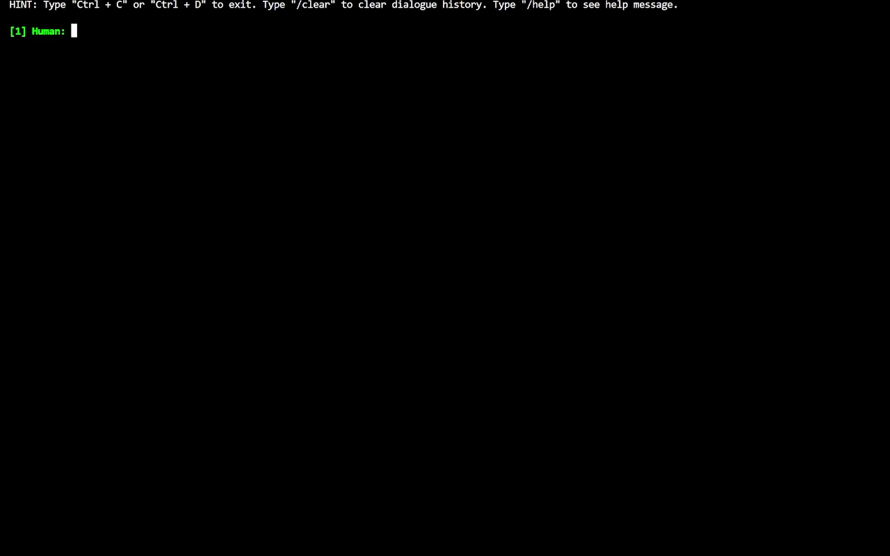

<!-- markdownlint-disable first-line-h1 -->
<!-- markdownlint-disable html -->

<div align="center">
  
  <div>&nbsp;</div>
  <div align="center">
    <b><font size="5">project website</font></b>
    <sup>
      <a href="https://space.bilibili.com/3493095748405551?spm_id_from=333.337.search-card.all.click">
        <i><font size="4">HOT</font></i>
      </a>
    </sup>
    &nbsp;&nbsp;&nbsp;&nbsp;
    <b><font size="5">PKU-Alignment Team</font></b>
    <sup>
      <a href="https://space.bilibili.com/3493095748405551?spm_id_from=333.337.search-card.all.click">
        <i><font size="4">welcome</font></i>
      </a>
    </sup>
  </div>
  <div>&nbsp;</div>

[](https://pypi.org/project/align-anything)
[](#license)

📘Documentation |
[🚀Features](#features) |
[🆕Update News](#news) |
[🛠️Installation](#installation) |
[👀Training](#train) |
[🤔Reporting Issues](#report-issues)
</div>

<div align="center">

[Our 100K Instruction-Following Datasets](https://huggingface.co/datasets/PKU-Alignment/Align-Anything-Instruction-100K)

</div>

Align-Anything is an open-source alignment framework for academic research based on DeepSpeed or NeMo (currently in development). It aims to align any modality large models (any-to-any models), including LLMs, VLMs, and others, with human intentions and values. More details about the definition and milestones of alignment for LLMs and other related information can be found in [AI Alignment](https://alignmentsurvey.com).

### Features

- Highly Modular Framework: Our framework offers a comprehensive collection of diverse alignment algorithms tailored for model alignment across various modalities. Its versatility stems from the abstraction of different algorithm types and a well-designed API, allowing users to easily modify and customize the code for different tasks.
- Support for Various Model Fine-Tuning: The framework includes fine-tuning capabilities for models such as LLaMA, LLaVA, Gemma, Qwen, Baichuan, and others (see [model-zoo](https://github.com/PKU-Alignment/align-anything/blob/main/Model-Zoo.md)).
- Support Alignment Fine-Tuning over Any Modality: It supports fine-tuning alignments for different modality model, including LLMs, VLMs, and other modalities (see [Development Roadmap](#development-roadmap)).
- Support Various Alignment Algorithms: The framework supports various alignment algorithms, including SFT, DPO, PPO, and others (see [example](https://github.com/PKU-Alignment/align-anything/tree/main/examples)).

#### Development Roadmap

We have a roadmap for future development work `align-anything`:

- [x] Support alignment algorithms over the `diffusion model`, `text to any generation model` and other `vision-language model`.
- [x] Support diverse parameter sizes including `LoRA`, `QLoRA`.
- [x] Support `vllm` backbone for evaluation.
- [ ] Support `NeMo` backbone for training.

| Modality                 | SFT | RM  | DPO | PPO |
| ------------------------ | --- | --- | --- | --- |
| Text -> Text             | ✔️   | ✔️   | ✔️   | ✔️   |
| Text+Image -> Text       | ✔️   | ✔️   | ✔️   | ✔️   |
| Text -> Image            | ✔️   | ⚒️   | ✔️   | ⚒️   |
| Text -> Video            | ✔️   | ⚒️   | ✔️   | ⚒️   |
| Text -> Audio            | ✔️   | ⚒️   | ✔️   | ⚒️   |
| Text+Image -> Text+Image | ✔️   | ✔️   | ✔️   | ✔️   |

- ✔️ : Features supported now.
- ⚒️ : In the planning.

# News

- 2024-08-17 🔥 We support DPO and PPO for `Text+Image -> Text+Image` modality models.
- 2024-08-15 🔥 We support a new function in the evaluation module: the `models_pk` script, which enables comparing the performance of two models across different benchmarks.
- 2024-08-06 🔥 We restructure the framework to support any modality evaluation and the supported benchmark list is [here](https://github.com/PKU-Alignment/align-anything/tree/main/align_anything/evaluation/benchmarks).
- 2024-08-06 🔥 We support `Text+Image -> Text+Image` modality for the SFT trainer and Chameleon models.
- 2024-07-23 🔥 We support `Text -> Image`, `Text -> Audio`, and `Text -> Video` modalities for the SFT trainer and DPO trainer.
- 2024-07-22 🔥 We support the **Chameleon** model for the SFT trainer and DPO trainer!
- 2024-07-17 🎉 We open-source the Align-Anything-Instruction-100K dataset for text modality. This dataset is available in both [English](https://huggingface.co/datasets/PKU-Alignment/Align-Anything-Instruction-100K) and [Chinese](https://huggingface.co/datasets/PKU-Alignment/Align-Anything-Instruction-100K-zh) versions, each sourced from different data sets and meticulously refined for quality by GPT-4.
- 2024-07-14 🎉 We open-source the `align-anything` framework.

# Installation

All model weights, training parameters, and tokenizers are stored in the `OUTPUT_DIR` you specified in advance.

```bash
conda create -n align-anything python==3.11
conda activate align-anything
git clone git@github.com:PKU-Alignment/align-anything.git
cd align-anything
pip install -e .
```

### Wandb Logger

We support `wandb` logging. By default, it is set to offline. If you need to view wandb logs online, you can specify the environment variables of `WANDB_API_KEY` before starting the training:

```bash
export WANDB_API_KEY="..."  # your W&B API key here
```

### Install from Dockerfile

<details>
<summary>How to build from Docker?</summary>
1. build docker image


```bash
FROM nvcr.io/nvidia/pytorch:24.02-py3

RUN echo "export PS1='[\[\e[1;33m\]\u\[\e[0m\]:\[\e[1;35m\]\w\[\e[0m\]]\$ '" >> ~/.bashrc

WORKDIR /root/align-anything
COPY . .

RUN python -m pip install --upgrade pip \
    && pip install -e .
```

then,

```bash
docker build --tag align-anything .
```

2. run the container

```bash
docker run -it --rm \
    --gpus all \
    --ipc=host \
    --ulimit memlock=-1 \
    --ulimit stack=67108864 \
    --mount type=bind,source=<host's mode path>,target=<docker's mode path> \
    test_docker
```

</details>


# Train

## Quick Start

Quick start examples can be found at [here](./examples/)

To prepare for training, all scripts are located in the `./scripts` and parameters that require user input have been left empty.

### Some Training Bugs

1. If you encounter errors during the training process:

```bash
No such file or directory: ':/usr/local/cuda/bin/nvcc'
```

To include the CUDA installation path and set the environment variables, modify the script as follows:

```bash
export CUDA_HOME="/usr/local/cuda"
```

or

```bash
export CUDA_HOME=$CONDA_PREFIX
```

The specific path depends on your `cuda` path.

## Customized Dataset

Align-anything offers a highly scalable dataset registration interface, enabling users to embed customized datasets simply by designing and specifying their `template.py`.

Taking [PKU-Alignment/PKU-SafeRLHF](https://huggingface.co/datasets/PKU-Alignment/PKU-SafeRLHF) as an example, we illustrate here how to design the template and incorporate it into a complete RLHF workflow.

The data key-value pairs for PKU-Alignment/PKU-SafeRLHF are as follows:

```python
{
  'prompt': '...',
  'response_0': '...',
  'response_1': '...',
  'better_response_id': 0
}
```

We first need to create a new template named PKUSafeRLHF for this dataset, and specify the required parameters such as system_prompt.

```python
@register_template('PKUSafeRLHF')
class PKUSafeRLHF(Template):
    system_prompt: str = 'BEGINNING OF CONVERSATION: '
    user_prompt: str = 'USER: {input} '
    assistant_prompt: str = 'ASSISTANT:{output}'
    split_token: str = 'ASSISTANT:'
```

### Reward modeling

The reward modeling requires the user to provide a dictionary with data keys as follows:

```python
{
  'better_text': '...',
  'worse_text': '...',
}
```

Therefore, the user needs to implement a key-value transformation logic in `align-anything/configs/template.py`, for instance, in this case:

```python
@register_template('PKUSafeRLHF')
class PKUSafeRLHF(Dialogue):

    def format_sample(self, raw_sample: dict[str, Any]) -> dict[str, Any]:
        metrics = raw_sample['better_response_id']
        better_response = raw_sample[f'response_{int(metrics)}']
        worse_response = raw_sample[f'response_{1-int(metrics)}']
        prompt = raw_sample['prompt']

        formatted_better_output = (
            f'{self.system_prompt}'
            f'{self.user_prompt.format(input=prompt)}'
            f'{self.assistant_prompt.format(output=better_response)}'
        )
        formatted_worse_output = (
            f'{self.system_prompt}'
            f'{self.user_prompt.format(input=prompt)}'
            f'{self.assistant_prompt.format(output=worse_response)}'
        )

        return {
            'better_text': formatted_better_output,
            'worse_text': formatted_worse_output,
        }
```

Here, `format_sample` parses the keys in the PKU-Alignment/PKU-SafeRLHF dataset, determines which response is better based on the `better_response_id`, and subsequently invokes previously defined parameters such as `system_prompt` to implement the transformation of key-value pairs.

### RL fine-tuning

During the RL fine-tuning phase, the model requires generation based on prompts within the dataset. Consequently, users need to implement key-value conversion in `template.py` using the following function:

```python
@register_template('PKUSafeRLHF')
class PKUSafeRLHF(Template):
    system_prompt: str = 'BEGINNING OF CONVERSATION: '
    user_prompt: str = 'USER: {input} '
    assistant_prompt: str = 'ASSISTANT:{output}'
    split_token: str = 'ASSISTANT:'

    def format_prompt_only_sample(self, raw_sample: dict[str, Any]) -> dict[str, Any]:
        prompt = raw_sample['prompt']

        formatted_prompt = (
            f'{self.system_prompt}'
            f'{self.user_prompt.format(input=prompt)}'
            f'{self.assistant_prompt.format(output="")}'
        )

        return {'text': formatted_prompt}
```

After designing the aforementioned template, you just need to specify this template by passing the `--train_template PKUSafeRLHF` argument when invoking the dataset to complete the corresponding training. Perhaps the above example still lacks specificity; therefore, we provide command references that encompass various models executing multiple algorithms on diverse datasets. You can expedite your training process by directly running or modifying these scripts [here](./examples/). For special task including `text image interleaved input and output` and  `any-to-text`, you can refer to [projects](./projects/).

# Evaluate

## Quick Start

To prepare for the evaluation, the script is located in the `./scripts directory`. Parameters requiring user input have been left empty and must be filled in before starting the evaluation process. For example, for `evaluate.sh`:

```bash
SCRIPT_DIR="$( cd "$( dirname "${BASH_SOURCE[0]}" )" && pwd )"
cd "${SCRIPT_DIR}/../align_anything/evaluation" || exit 1

BENCHMARKS=("")
OUTPUT_DIR=""
GENERATION_BACKEND=""
MODEL_ID=""
MODEL_NAME_OR_PATH=""
CHAT_TEMPLATE=""

for BENCHMARK in "${BENCHMARKS[@]}"; do
    python __main__.py \
        --benchmark ${BENCHMARK} \
        --output_dir ${OUTPUT_DIR} \
        --generation_backend ${GENERATION_BACKEND} \
        --model_id ${MODEL_ID} \
        --model_name_or_path ${MODEL_NAME_OR_PATH} \
        --chat_template ${CHAT_TEMPLATE}
done
```

- `BENCHMARKS`: One or more evaluation benchmarks or datasets for assessing the model's performance. For example, `("POPE" "MMBench")` can be used to evaluate the model on both the POPE and MMBench datasets. Each benchmark in the list will be processed sequentially.
- `OUTPUT_DIR`: The directory for saving the evaluation results and output files.
- `GENERATION_BACKEND`: The backend used for generating predictions, `vLLM` or `deepspeed`.
- `MODEL_ID`: Unique identifier for the model, used to track and distinguish model evaluations, like `llava-1.5-7b-hf`.
- `MODEL_NAME_OR_PATH`: The local path or Hugging Face link of model, such as `llava-hf/llava-1.5-7b-hf`.
- `CHAT_TEMPLATE`: Chat template id of your model, like `LLAVA`. More details can be refered in `./align_anything/configs/template.py`.

To compare multiple models' performance across one or more benchmarks, located in the `./scripts`, the `models_pk.sh` script allows you to evaluate across different models and then compare their results. Ensure all parameters are correctly filled in before running the script.

```bash
SCRIPT_DIR="$( cd "$( dirname "${BASH_SOURCE[0]}" )" && pwd )"
cd "${SCRIPT_DIR}/../align_anything/evaluation" || exit 1

BENCHMARKS=("")
OUTPUT_DIR=""
GENERATION_BACKEND=""
MODEL_IDS=("" "")
MODEL_NAME_OR_PATHS=("" "")
CHAT_TEMPLATES=("" "")

for BENCHMARK in "${BENCHMARKS[@]}"; do
    echo "Processing benchmark: ${BENCHMARK}"
    
    for i in "${!MODEL_IDS[@]}"; do
        MODEL_ID=${MODEL_IDS[$i]}
        MODEL_NAME_OR_PATH=${MODEL_NAME_OR_PATHS[$i]}
        CHAT_TEMPLATE=${CHAT_TEMPLATES[$i]}
        
        echo "Running model ${MODEL_ID} for benchmark ${BENCHMARK}"
        python __main__.py \
            --benchmark ${BENCHMARK} \
            --output_dir ${OUTPUT_DIR} \
            --generation_backend ${GENERATION_BACKEND} \
            --model_id ${MODEL_ID} \
            --model_name_or_path ${MODEL_NAME_OR_PATH} \
            --chat_template ${CHAT_TEMPLATE}
    done

    python models_pk.py --benchmark ${BENCHMARK} \
                        --model_1 "${MODEL_IDS[0]}" \
                        --model_2 "${MODEL_IDS[1]}"
done
```

- `BENCHMARKS`: One or more evaluation benchmarks or datasets for assessing the model's performance. For example, `("POPE" "MMBench")` can be used to evaluate the model on both the POPE and MMBench datasets. Each benchmark in the list will be processed sequentially.
- `OUTPUT_DIR`: The directory for saving the evaluation results and output files.
- `GENERATION_BACKEND`: The backend used for generating predictions, `vLLM` or `deepspeed`.
- `MODEL_IDS`: An array of two unique identifiers for the models being evaluated, such as `("llava-1.5-7b-hf" "llava-1.5-13b-hf")`. These IDs help track and distinguish between different model evaluations.
- `MODEL_NAME_OR_PATHS`: An array of two paths to the models' weights or their names if hosted on Hugging Face, such as `("llava-hf/llava-1.5-7b-hf" "llava-hf/llava-1.5-13b-hf")`.
- `CHAT_TEMPLATES`: An array of two chat template IDs corresponding to each model, such as `("LLAVA" "LLAVA")`. This defines the format or style of responses generated by each model.

Additionally, you should modify the config file corresponding to the benchmark under `./align_anything/configs/evaluation/benchmarks` to adapt to specific evaluation tasks and specify test models.

For more inference parameters, please see `./align_anything/configs/evaluation/vllm` and `./align_anything/configs/evaluation/deepspeed`, depending on your generation backend.

For more details about the evaluation pipeline, refer to [here](https://github.com/PKU-Alignment/align-anything/blob/main/align_anything/evaluation/README.md).


# Inference

## Interactive Client

```bash
python3 -m align_anything.serve.cli --model_name_or_path your_model_name_or_path
```



## Interactive Arena

```bash
python3 -m align_anything.serve.arena --red_corner_model_name_or_path your_red_model_name_or_path --blue_corner_model_name_or_path your_blue_model_name_or_path
```


## Why do we open source align-anything?

Ensuring that the behavior of AI system aligns with human intentions and values is crucial, and alignment techniques provide an effective solution. For large language models (LLMs), methods such as reinforcement learning with human feedback (RLHF) and direct preference optimization (DPO) have significantly improved performance and safety. As models evolve to handle any-modality inputs and outputs, effectively aligning them remains a current research challenge. `Align-Anything` framework integrates alignment tuning across modalities using well-designed interfaces and advanced abstractions, offering a comprehensive testbed for research.

### Report Issues

If you have any questions in the process of using Align-Anything, don't hesitate to ask your questions on [the GitHub issue page](https://github.com/PKU-Alignment/align-anything/issues/new/choose), we will reply to you in 2-3 working days.


## Citation

Please cite the repo if you use the data or code in this repo.

```bibtex
@misc{align_anything,
  author = {PKU-Alignment Team},
  title = {Align Anything: Training Any Modality Model with Feedback},
  year = {2024},
  publisher = {GitHub},
  journal = {GitHub repository},
  howpublished = {\url{https://github.com/PKU-Alignment/align-anything}},
}
```

## License

Align-Anything is released under Apache License 2.0.