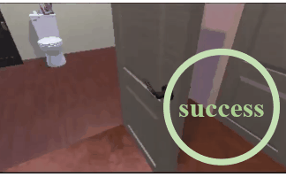

# Align VLA

<div style="text-align: center;">
    
</div>

|| <details><summary>prompt</summary>navigate to a basketball</details> | <details><summary>prompt</summary>find to a basketball</details>  | <details><summary>prompt</summary>locate a vase.</details> |<details><summary>prompt</summary>find a spray bottle and pick up that spray bottle</details>|
|---| ---------------------------------- | --- | --- | --- |
|Baseline| |  |   | |
|**AlignVLA**|  |  |   | |
> Alignment fine-tuning can significantly enhance the security performance of the VLA model.

## Setting up the Python environment

Currently only supports Python 3.10
```bash
cd align_anything/trainers/text_video_to_action
pip install -r requirements.txt
pip install --extra-index-url https://ai2thor-pypi.allenai.org ai2thor==0+966bd7758586e05d18f6181f459c0e90ba318bec
pip install --extra-index-url https://miropsota.github.io/torch_packages_builder detectron2==0.6+864913fpt2.1.2cu121
```


## Data

### Downloading the training data

```bash
python -m align_anything.trainers.text_video_to_action.download_training_data --save_dir ./path/to/your/data  --types astar
```
Then decompress the compressed data package.

#### Dataset format

Once you run the above command, you will have a directory structure that looks like this
```
/your/local/save/dir/<astar OR all>_type
    <TASK_TYPE>
        house_id_to_sub_house_id_train.json # This file contains a mapping that's needed for train data loading
        house_id_to_sub_house_id_val.json   # This file contains a mapping that's needed for val data loading
        train
            <HOUSEID>
                hdf5_sensors.hdf5 -- containing all the sensors that are not videos
                    <EPISODE_NUMBER>
                        <SENSOR_NAME>
                raw_navigation_camera__<EPISODE_NUMBER>.mp4
                raw_manipulation_camera__<EPISODE_NUMBER>.mp4
        val
            # As with train
```


## Running IL Training

modify ``HOME_PREFIX`` in ``align-anything/scripts/il_training.sh`` to your local data path.


```bash
bash scripts/il_training.sh
```


## Running RL finetuning

coming soon

## Running evaluation with a trained model

coming soom
