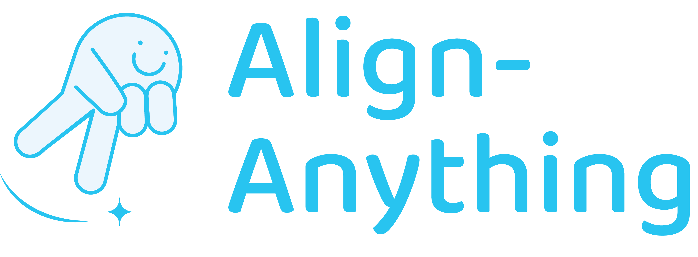

.. OmniSafe documentation master file, created by
    sphinx-quickstart on Fri Nov  4 19:59:00 2022.
    You can adapt this file completely to your liking, but it should at least
    contain the root `toctree` directive.

.. Welcome to OmniSafe's documentation!
.. ====================================

Introduction
============

Welcome To Align-Anything Tutorial
----------------------------------

Welcome to `Align-Anything <https://github.com/PKU-Alignment/align-anything>`_ in AI alignment! Align-Anything aims to align any modality large models (any-to-any models), including LLMs, VLMs, and others, with human intentions and values. More details about the definition and milestones of alignment for Large Models can be found in `AI Alignment <https://alignmentsurvey.com>`_.