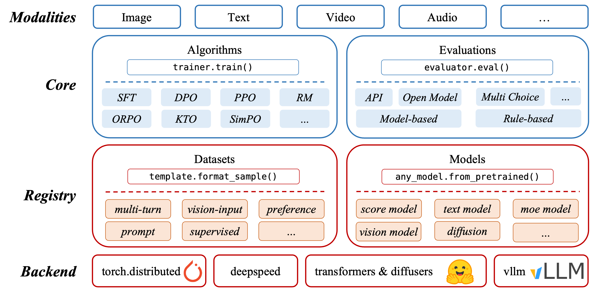
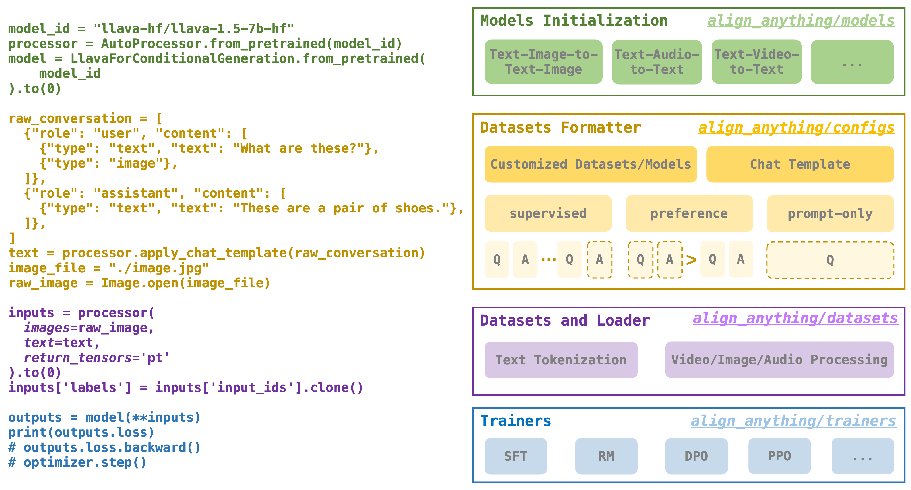

Welcome to align-anything
=========================

Welcome to `align-anything <https://github.com/PKU-Alignment/align-anything>`_ in AI alignment! align-anything aims to align any modality large models (any-to-any models), including LLMs, VLMs, and others, with human intentions and values. More details about the definition and milestones of alignment for Large Models can be found in `AI Alignment <https://alignmentsurvey.com>`_.

Quick Start and Example
-----------------------

We will introduce the usage of align-anything with a very simple example. Below is the official inference code for the classic vision-language model `llava-hf/llava-1.5-7b-hf <https://huggingface.co/llava-hf/llava-1.5-7b-hf>`_ (short as LLaVA):

0. First, import the necessary libraries

.. code:: python

   import requests
   from PIL import Image

   import torch
   from transformers import AutoProcessor, LlavaForConditionalGeneration

1. Then, initialize the ``model`` and ``processor``. Here, ``model_id`` is the remote path of the model on huggingface.

.. code:: python

   # Model and Processor initialization
   model_id = "llava-hf/llava-1.5-7b-hf"
   model = LlavaForConditionalGeneration.from_pretrained(
      model_id,
      torch_dtype=torch.float16,
      low_cpu_mem_usage=True,
   ).to(0)
   processor = AutoProcessor.from_pretrained(model_id)

2. Then, prepare the data, which includes both text and images.

.. note::

   Each large model has its own ``chat_template`` format. Huggingface provides the ``apply_chat_template`` function to automatically format a list named ``conversation``. In this example, the formatted prompt is as follows:

   .. code:: python

      # User: <image> What are these?
      # Assistant:

.. code:: python

   # Data preparation
   conversation = [
      {
         "role": "user",
         "content": [
            {"type": "text", "text": "What are these?"},
            {"type": "image"},
         ],
      },
   ]
   prompt = processor.apply_chat_template(conversation, add_generation_prompt=True)

   image_file = "http://images.cocodataset.org/val2017/000000039769.jpg"
   raw_image = Image.open(requests.get(image_file, stream=True).raw)

3. Finally, convert the corresponding modality data to ``Tensor`` using ``processor``, input it into the model, and get the output.

.. code:: python

   inputs = processor(images=raw_image, text=prompt, return_tensors='pt').to(0, torch.float16)
   # Here, the text input -> ``input_ids`` tensor by the tokenizer.
   # And the ``images`` input -> ``pixel_values`` tensor by the image processor.

   output = model.generate(**inputs, max_new_tokens=200, do_sample=False)
   print(processor.decode(output[0][2:], skip_special_tokens=True))

.. hint::

   The above example shows us the full process of input and output for LLaVA. In fact, it is also the implementation approach for most current multimodal models. On this basis, training various algorithms only requires designing the corresponding ``loss function``. Therefore, the complete process is as follows:

   1. **Model Initialization**: Load the model and processor
   2. **Data Preparation**: Parse the dataset and format it
   3. **Model Inference**: Input the data into the model and get the output
   4. **Gradient Update**: Update model parameters based on the ``loss function``

What align-anything does is to use a framework to scale up the simple process above to any modality model. The underlying logic of this framework is precisely the four steps mentioned above. We will provide the align-anything implementation of LLaVA's SFT code here, and implementations for other modalities are similar. After reading this example, you should fully understand the usage and underlying logic of align-anything.

Advanced Features and Framework Design
--------------------------------------

.. tab-set::

   .. tab-item:: Model Initialization

      Loading the model is very simple, just provide the path to the model.

      .. code:: python

         from align_anything.models.pretrained_model import load_pretrained_models
         self.model, self.tokenizer, self.processor = load_pretrained_models(
            self.cfgs.model_cfgs.model_name_or_path,
            model_max_length=self.cfgs.model_cfgs.model_max_length,
            padding_side='right',
            trust_remote_code=True,
         )

      However, multimodal models often belong to different classes in `transformers <https://huggingface.co/docs/transformers/index>`_, and models of different modalities need to use different classes. For example:

      .. hint::

         For LLaVA, we use ``LlavaForConditionalGeneration`` to load the model.

         .. code:: python

            model_id = "llava-hf/llava-1.5-7b-hf"
            model = LlavaForConditionalGeneration.from_pretrained(
               model_id,
               torch_dtype=torch.float16,
            ).to(0)

         But for LLaMA, we use ``LlamaForCausalLM`` to load the model.

         .. code:: python

            model_id = "meta-llama/Llama-3.1-8B-Instruct"
            model = LlamaForCausalLM.from_pretrained(
               model_id,
               torch_dtype=torch.float16,
            ).to(0)

      Therefore, align-anything refers to the model registration implementation in transformers and uses a class named ``AnyModel`` to uniformly load models of all modalities. It supports the following types of model loading:

      1. Models manually supported in align-anything

      .. code:: python

         MODEL_MAPPING_NAMES: OrderedDict[str, str] = OrderedDict(
            [
               # Score model mapping
               ('llama', 'AccustomedLlamaModel'),
               ('mllama', 'AccustomedMllamaModel'),
               ('llava', 'AccustomedLlavaModel'),
               ('llava_next', 'AccustomedLlavaNextModel'),
               ('qwen2_audio', 'AccustomedQwen2AudioModel'),
               ('chameleon', 'AccustomedChameleonModel'),
               ('qwen2_vl', 'AccustomedQwen2VLModel'),
               ('modeling_emu3.mllm.modeling_emu3', 'Emu3ForCausalLM'),
            ],
         )

      2. Models that can be loaded using ``AutoModelForCausalLM`` in transformers

      .. code:: python

         MODEL_MAPPING: OrderedDict[str, Any] = _LazyAutoMappingInAlignAnything(
            CONFIG_MAPPING_NAMES,
            MODEL_FOR_CAUSAL_LM_MAPPING_NAMES | MODEL_MAPPING_NAMES,
         )

      You must have noticed that the class names registered in align-anything contain the ``Accustomed`` prefix. This is an interface provided by the align-anything framework for users to customize the ``forward`` function.

      .. warning::

         Normally, as shown in the example above, data processed by the ``processor`` can be directly input into the model. However, models like `MiniCPM-V <https://huggingface.co/openbmb/MiniCPM-V/tree/main>`_ do not support tools like ``processor``. We provide such a customized class interface for such models, allowing users to modify the code within to adapt to the framework.

      1. For models like LLaVA that support ``processor``, we did not perform any operations during registration but just directly use its original class.

      .. code:: python

         class AccustomedLlavaModel(LlavaForConditionalGeneration):
            """Accustomed Interface for LlaVA model"""

      2. For models like MiniCPM-V, we need to modify some code during registration to make it suitable for training. Specific details can be found in the implementation in ``align_anything/models/minicpmv.py``.

      .. code:: python

         class AccustomedMiniCPMV(MiniCPMV):
            """Accustomed Interface for MiniCPM-V model"""

            def __init__(self, config: AutoConfig):
               super().__init__(config)
               zero_stage = int(os.environ['ZERO_STAGE'])
               if zero_stage == 3:
                     raise ValueError('MiniCPM-V does not support ZeRO stage 3')
               self.tokenizer = AutoTokenizer.from_pretrained(MODEL_NAME_OR_PATH, trust_remote_code=True)

            @property
            def processor_available(self):
               return False

            def infer_batch(self, batch: dict[str, torch.Tensor]) -> dict[str, torch.Tensor]:
               """Return the dict used for model inference"""
               return {
                     'input_ids': batch['input_ids'],
                     'attention_mask': batch['attention_mask'],
                     'images': batch['images'],
                     'labels': batch.get('labels'),
               }

            ...

   .. tab-item:: Data Preparation

      Using customized datasets in align-anything involves 2 steps: **key-value parsing** and **template formatting**.

      1. **Key-value parsing**

      The motivation for key-value parsing is to assemble different key-value pairs from diverse open-source datasets into the corresponding ``conversation`` list for algorithm training.

      .. hint::

         For Alpaca dataset, the key-value parsing is:

         .. code:: python

            prompt = ' '.join((raw_sample['instruction'], raw_sample['input']))
            response = raw_sample['output']
            return [
                  {'role': 'user', 'content': prompt},
                  {'role': 'assistant', 'content': response},
            ], {}

         But for other datasets, it maybe:

         .. code:: python

            prompt = raw_sample['prompt']
            answer = raw_sample['response']

            return [
                  {'role': 'user', 'content': [{'type': 'text', 'text': prompt}]},
                  {'role': 'assistant', 'content': [{'type': 'text', 'text': answer}]},
            ], {}

      Below are the data format requirements for different algorithms:

      .. note::

         - **SFT**: Requires data to contain complete question-answer pairs.
         - **RM/DPO/Other preference alignment algorithms**: Requires data to contain chosen and rejected question-answer pairs.
         - **PPO**: Requires data to contain only prompts.

      To this end, align-anything designed a mechanism named ``DataFormatter`` and provided 3 functions to meet the data format requirements of different algorithms:

      - ``def format_supervised_sample(self, raw_sample: dict[str, Any]) -> tuple[list[dict[str, Any]], dict]``. The input is a single data, and the output is a ``conversation`` list and a ``meta_data`` dictionary. The ``meta_data`` dictionary contains multimodal information, such as images, audio merged with video, etc.

      .. toggle::
         :show:

         .. code:: python

            @register_template('Alpaca')
            class Alpaca(BaseFormatter):

            def format_supervised_sample(self, raw_sample: dict[str, Any]) -> tuple[list[dict[str, Any]], dict]:
               prompt = ' '.join((raw_sample['instruction'], raw_sample['input']))
               response = raw_sample['output']
               return [
                     {"role": "user", "content": prompt},
                     {"role": "assistant", "content": response},
               ], {}

      - ``def format_preference_sample(  self, raw_sample: dict[str, Any]) -> tuple[list[dict[str, Any]], list[dict[str, Any]], dict]``. The input is a single data, and the output is the chosen and rejected ``conversation`` lists and a ``meta_data`` dictionary.

      .. toggle::
         :show:

         .. code:: python

            @register_template('AA_TI2T')
            class AA_TI2T(BaseFormatter):
               system_prompt: str = ""

               def format_preference_sample(self, raw_sample: dict[str, Any]) -> tuple[list[dict[str, Any]], list[dict[str, Any]], dict[str, Any]]:
                  better_id = int(raw_sample['overall_response'])
                  worse_id = 2 if better_id==1 else 1

                  if better_id not in [1, 2] or worse_id not in [1, 2]:
                        return [], [], {}

                  raw_better_response = raw_sample[f'response_{better_id}']
                  raw_worse_response = raw_sample[f'response_{worse_id}']
                  prompt = raw_sample['question']
                  image = raw_sample['image'].convert('RGBA')
                  better_conversation = [
                        {'role': 'user', 'content': [
                              {'type': 'image'},
                              {'type': 'text', 'text': prompt},
                           ]
                        },
                        {'role': 'assistant', 'content': [{'type': 'text', 'text': raw_better_response}]},
                  ]
                  worse_conversation = [
                        {'role': 'user', 'content': [
                              {'type': 'image'},
                              {'type': 'text', 'text': prompt},
                           ]
                        },
                        {'role': 'assistant', 'content': [{'type': 'text', 'text': raw_worse_response}]},
                  ]

                  meta_info = {
                        'image': image,
                        'better_response': raw_better_response,
                        'worse_response': raw_worse_response,
                  }

                  return better_conversation, worse_conversation, meta_info

      - ``def format_prompt_only_sample(self, raw_sample: dict[str, Any]) -> tuple[list[dict[str, Any]], dict]``. The input is a single data, and the output is a ``conversation`` list containing only the ``prompt`` and a ``meta_data`` dictionary.

      .. toggle::
         :show:

         .. code:: python

            @register_template('AA_TA2T')
            class AA_TA2T(BaseFormatter):
               system_prompt: str = 'You are a helpful assistant.'

               def format_prompt_only_sample(self, raw_sample: dict[str, Any]) -> dict[str, Any]:
                  prompt = raw_sample['prompt']
                  audio_path = raw_sample['audio_path']

                  conversation = [
                        {'role': 'system', 'content': [{'type': 'text', 'text': self.system_prompt}]},
                        {'role': 'user', 'content': [
                              {'type': 'audio', 'audio_url': audio_path},
                              {'type': 'text', 'text': prompt},
                           ]},
                  ]

                  return conversation, {'audio_path': audio_path}

      2. **Template formatting**

      align-anything uses ``ModelFormatter`` to format the input ``conversation`` list. This mechanism is threefold:

      - Default template:

      .. toggle::
         :show:

         .. code:: python

            def default_format(
               self, raw_sample: list[dict[str, Any]], add_generation_prompt: bool = False
            ) -> str:
            final_text = ''
            for line in raw_sample:
                  for content in line['content']:
                     if content['type'] == 'text':
                        final_text += line['role'].upper() + ': ' + content['text'] + '\n'
            if add_generation_prompt:
                  final_text += 'ASSISTANT: '
            return final_text

      - Templates supported by transformers:

      .. toggle::
         :show:

         .. code:: python

            processor = AutoProcessor.from_pretrained(model_id)
            processor.apply_chat_template(conversation)

      - Custom templates in the corresponding model in the ``align_anything/models/`` folder:

      .. toggle::
         :show:

         .. code:: python

            class AccustomedMiniCPMV(MiniCPMV):

               def apply_chat_template(
                  self, messages: list[dict[str, Any]], add_generation_prompt: bool = False
               ) -> dict[str, Any]:
                  conversation = ''
                  for message in messages:
                        role = message['role']
                        contents = message['content']
                        for content in contents:
                           if content['type'] == 'text':
                              if role == 'user':
                                    content = (
                                       '<User>'
                                       + self.tokenizer.im_start
                                       + self.tokenizer.unk_token * self.config.query_num
                                       + self.tokenizer.im_end
                                       + '\n'
                                       + content['text']
                                    )
                              else:
                                    content = '<AI>' + '\n' + content['text']
                              conversation += content
                  if add_generation_prompt:
                        conversation += '<AI>'
                  return conversation

         During the actual execution of the code, the priority of the templates is: custom template > transformers built-in template > default template.

   .. tab-item:: Model Inference and Gradient Update

      1. Inference Data Preparation

      align-anything uses ``Datasets`` and ``DataLoader`` to load datasets and data, processing the formatted data into ``torch.Tensor`` to input into the model and get the output. The code implementation of this step is relatively simple, and you can refer to the implementation in ``align_anything/datasets/text_image_to_text/supervised.py``. Its core code is to call ``processor`` to process the data into ``torch.Tensor``:

      .. toggle::
         :show:

         .. code:: python

            multi_modal_padding = self.processor(
               images=images,
               text=concated_text,
               return_tensors='pt',
               padding=True,
               padding_side=self.padding_side,
               return_attention_mask=True,
            )

      2. Training

      The training code includes the main training loop, linking all the sections introduced above. Specifically, align-anything implements a ``Trainer`` class for different algorithms of different modalities, and their main parts include:

      1. Initialization: Call ``init_models()`` to load the model and processor, call ``init_datasets()`` to load the dataset, call ``init_engines()`` to set up the DeepSpeed acceleration framework, and call ``init_logger()`` to set up the logger.

      Among them, the underlying logic of ``init_models()`` and ``init_datasets()`` has been introduced in the previous text. The ``init_engines()`` and ``init_logger()`` parts do not require user modification, so we will not introduce them in detail here.

      2. Main Training Loop: Call ``train()`` to train.

      .. toggle::
         :show:

         .. code:: python

            def train(self) -> None:
               """Train the model."""

               progress_bar = tqdm(
                     total=self.cfgs.train_cfgs.epochs * len(self.train_dataloader),
                     desc=f'Training 1/{self.cfgs.train_cfgs.epochs} epoch',
                     position=0,
                     leave=True,
                     disable=not is_main_process(),
               )

               for epoch in range(int(self.cfgs.train_cfgs.epochs)):
                     self.model.train()

                     for batch in self.train_dataloader:
                        info = self.train_step(batch)
                        torch.cuda.empty_cache()

                        self.global_step += 1

                        info['train/epoch'] = self.global_step / len(self.train_dataloader)

                        if self.global_step % self.cfgs.logger_cfgs.save_interval == 0:
                           self.save(tag=self.global_step)

         The main training loop is very simple, and the gradient update logic of each algorithm is implemented in ``train_step()``. For example, for SFT, the implementation of ``train_step()`` is the ``CrossEntropyLoss`` that comes with transformers:

         .. code:: python

            def train_step(self, batch: dict[str, Any]) -> dict[str, Any]:
               outputs = self.model(**batch)
               loss = outputs.loss
               return {'train/loss': loss.item()}

Report Issues
-------------

If you have any questions in the process of using align-anything, don’t
hesitate to ask your questions on `the GitHub issue
page <https://github.com/PKU-Alignment/align-anything/issues/new/choose>`__,
we will reply to you in 2-3 working days.

Citation
--------

Please cite the repo if you use the data or code in this repo.

.. code:: bibtex

   @misc{align_anything,
     author = {PKU-Alignment Team},
     title = {Align Anything: training all modality models to follow instructions with unified language feedback},
     year = {2024},
     publisher = {GitHub},
     journal = {GitHub repository},
     howpublished = {\url{https://github.com/PKU-Alignment/align-anything}},
   }

.. toctree::
    :hidden:
    :maxdepth: 3
    :caption: Dataset

    data/text_to_text

.. toctree::
    :hidden:
    :maxdepth: 3
    :caption: Training

    training/overview
    training/configs
    training/dataset_custom
    training/any_to_any

.. toctree::
    :hidden:
    :maxdepth: 3
    :caption: Tutorial

    tutorial/chameleon

.. toctree::
    :hidden:
    :maxdepth: 3
    :caption: Evaluation

    evaluation/overview
    evaluation/example
    evaluation/evaluation_configurations
