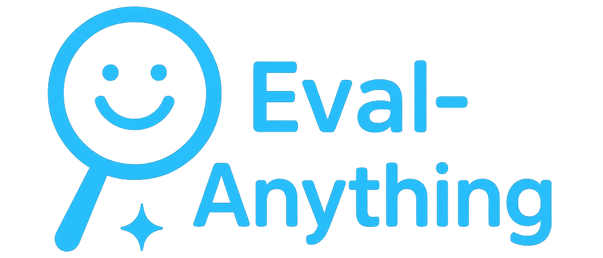

<div align="center">
  
  <div>&nbsp;</div>

[](https://github.com/PKU-Alignment) [](#license)


[📘Benchmark List](#Tasks-and-Datasets) |
[🛠️Quick Start](#Quick-Start) |
[💡Contributing a New Bench](#Contributing-a-New-Bench) |
[🤔Reporting Issues](#Reporting-Issues)

</div>

# Introduction

**Eval-anything** aims to track the performance of all modality large models (any-to-any models) on safety tasks and evaluate their true capabilities.

* **Datasets**

  - **Self-developed Dataset**: A dataset specifically designed for assessing all-modality safety of large models.

  - **Integration of Over 50 Open-source Datasets**: Diverse data sources for comprehensive safety assessment.

  - **Five Core Evaluation Dimensions** with 35 sub-dimensions.

- **Embodied Safety Evaluation Framework:**
  - **Covering Various Modality Evaluations**: Text, image, video, speech, and action.
  - **Defining Major Task Categories in Embodied Safety**: Corner cases, blind spots, fragile collections, critical points, and dangerous equipment.
  - **Proposing Major Goals of Embodied Safety Evaluation**: Execution safety, long-range trajectory safety, and hardware safety.

* **Platform Integration**
  - Eval-anything seamlessly integrates with [FlagEval](https://flageval.baai.ac.cn/) to enhance assessment effectiveness.

# Contents

[Introduction](#Introduction)

[Contents](#Contents)

[Tasks and Datasets](#Tasks-and-Datasets)

[Quick Start](#Quick-Start)

[Contributing a New Bench](#Contributing-a-New-Bench)

[Reporting Issues](#Reporting-Issues)

[Acknowledgements](#Acknowledgements)


# Tasks and Datasets

Eval-anything integrated a diversity of open-source/self-developed benchmarks on LM safety. See [benchmark document](eval_anything/benchmarks/benchmark.md) for more information.

# Quick Start

* Step1: Install `eval-anything` by:

  ```bash
  pip install -e .
  conda create -n eval-anything python==3.11
  ```

* Step2: Set up [configuration files](eval_anything/configs/evaluate.yaml).

* Step3: Run the evaluation task by:

  ```bash
  bash scripts/run.sh
  ```

## Running VLA Benchmarks

1. Configuring `objaverse`

```bash
python -m objathor.dataset.download_annotations --version 2023_07_28 --path /path/to/objaverse_assets
python -m objathor.dataset.download_assets --version 2023_07_28 --path /path/to/objaverse_assets
```

2. Configuring `house`

```bash
python scripts/download_objaverse_houses.py --save_dir /path/to/objaverse_houses --subset val
```

or

```bash
python scripts/download_objaverse_houses.py --save_dir /path/to/objaverse_houses --subset train
```

3. Downloading Datasets

```bash
python scripts/download_dataset.py --save_dir /path/to/dataset
```

4. Configuring Environments

```bash
pip install -e .[vla]
pip install --extra-index-url https://ai2thor-pypi.allenai.org ai2thor==0+966bd7758586e05d18f6181f459c0e90ba318bec
pip install -e "git+https://github.com/allenai/allenact.git@d055fc9d4533f086e0340fe0a838ed42c28d932e#egg=allenact&subdirectory=allenact" --no-deps
pip install -e "git+https://github.com/allenai/allenact.git@d055fc9d4533f086e0340fe0a838ed42c28d932e#egg=allenact_plugins[all]&subdirectory=allenact_plugins" --no-deps
```

5. Running tasks

```bash
bash scripts/run_vla.sh
```

# Contributing a New Bench

We are accepting PRs for new benchmarks. Please read the [development document](development.md) carefully before you contribute your benchmark.

# Reporting Issues

If you have any questions in the process of using align-anything, don't hesitate to ask your questions on [the GitHub issue page](https://github.com/PKU-Alignment/eval-anything/issues/new/choose), we will reply to you in 2-3 working days.

# License

Eval-anything is released under [Apache License 2.0](LICENSE).


# Acknowledgements

This repository benefits from multiple open-source projects. Thanks for their wonderful works and their efforts for promoting the LLM research.

This work is supported by the **Beijing Academy of Artificial Intelligence**, **Peking University** and **Beijing University of Posts and Telecommunications**.

<table width="100%" cellspacing="0" cellpadding="0">
  <tr align="center" valign="middle">
    <td width="30%">
      <a href="https://www.baai.ac.cn/">
        
      </a>
    </td>
    <td width="30%">
      <a href="https://www.pku.edu.cn/">
        
      </a>
    </td>
    <td width="30%">
      <a href="https://www.bupt.edu.cn/">
        
      </a>
    </td>
  </tr>
</table>
