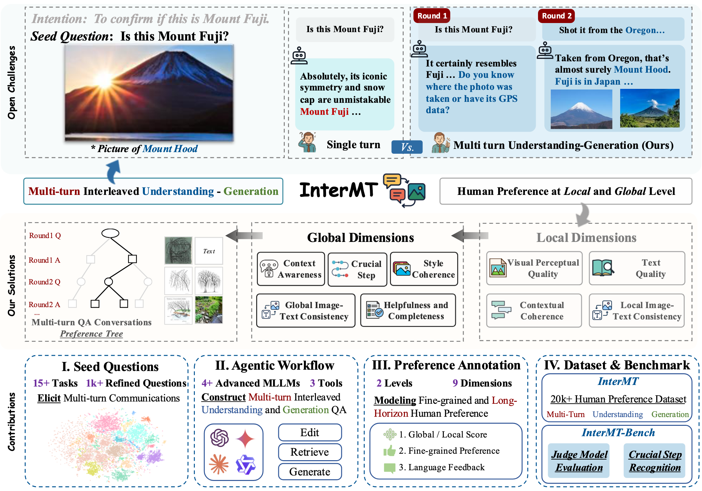

# NeurIPS 2025 (Spotlight): InterMT: Multi-Turn Interleaved Preference Alignment with Human Feedback

[🏠 Homepage](https://pku-intermt.github.io/) | [🤗 InterMT Dataset](https://huggingface.co/datasets/PKU-Alignment/InterMT) | [👍 InterMT-Bench](https://github.com/cby-pku/INTERMT)


## Abstract
As multimodal large models (MLLMs) continue to advance across challenging tasks, a key question emerges: **What essential capabilities are still missing?**
A critical aspect of human learning is continuous interaction with the environment -- not limited to language, but also involving multimodal understanding and generation.
To move closer to human-level intelligence, models must similarly support **multi-turn**, **multimodal interaction**. In particular, they should comprehend interleaved multimodal contexts and respond coherently in ongoing exchanges.
In this work, we present **an initial exploration** through the *InterMT* -- **the first preference dataset for *multi-turn* multimodal interaction**, grounded in real human feedback. In this exploration, we particularly emphasize the importance of human oversight, introducing expert annotations to guide the process, motivated by the fact that current MLLMs lack such complex interactive capabilities. *InterMT* captures human preferences at both global and local levels into nine sub-dimensions, consists of 15.6k prompts, 52.6k multi-turn dialogue instances, and 32.4k human-labeled preference pairs. 
To compensate for the lack of capability for multi-modal understanding and generation, we introduce an agentic workflow that leverages tool-augmented MLLMs to construct multi-turn QA instances.
To further this goal, we introduce *InterMT-Bench* to assess the ability of
MLLMs in assisting judges with multi-turn, multimodal tasks.
We demonstrate the utility of *InterMT* through applications such as judge moderation and further reveal the *multi-turn scaling law* of judge model.
We hope the open-source of our data can help facilitate further research on aligning current MLLMs to the next step.




## InterMT
[🤗 InterMT Dataset](https://huggingface.co/datasets/PKU-Alignment/InterMT) 

The InterMT dataset includes: (1) carefully crafted *seed questions* for multi-turn, multimodal conversations, and (2) fine-grained human preference annotations at both local and global conversation levels. Inspired by theories from linguistics, human-computer interaction, and cognitive psychology, the seed questions are rigorously selected and refined to enable more faithful simulation of real-world multi-turn understanding and generation tasks.
We collect preference data through score evaluations and pairwise comparisons of multi-modal responses at each conversation turn, based on four sub-dimensions. Global conversation helpfulness is then evaluated via five sub-dimensions. Incorporating natural language feedback further improves annotation quality and alignment with human intent.
The **Data Card** for InterMT is as follow:
1. InterMT is built from a corpus of 100k image-text examples, comprising 72.1% from open-source vision-language datasets, 22.8% from web data, and 5.1% from human-written content. All prompts are refined following constitutional guidelines to improve multi-turn compatibility, resulting in 15604 unique seed questions.
2. Each seed question is expanded via an agent-based multi-turn QA construction workflow, producing at least 8 multi-turn QA instances per prompt. After pruning and filtering, we obtain 52.6k high-quality multi-turn QA instances, with 41.92% containing five or more turns.
3. The resulting 52.6k QA instances cover 15+ vision-language understanding and generation tasks, such as image editing and visual tutorials. Each instance features interleaved textual and visual content in both inputs and outputs, with an average of 5.33 images per conversation.
4. InterMT features 32,459 human preference annotations, organized as score evaluation pairwise comparisons at both the local and global levels. Preferences are decomposed into 9 dimensions of helpfulness, accompanied by human-written critiques, refinement suggestions, and rationales.


## InterMT-Bench
We leverage genuine human-annotated data collected in **InterMT** to construct **InterMT-Bench**, a benchmark designed to evaluate the alignment between models and human values in multi-turn multimodal interaction scenarios. Our evaluation focuses on three key aspects: *Score Evaluation*, *Pair Comparison*, and *Crucial Step Recognition*.

`./intermt_bench` contains our open-sourced InterMT-Bench along with corresponding evaluation code and prompts


For more details and information, please visit our [website](https://pku-intermt.github.io)

## Citation

Please cite the repo if you find the model or code in this repo useful 😊

```bibtex
@article{chen2025intermt,
  title={InterMT: Multi-Turn Interleaved Preference Alignment with Human Feedback},
  author={Boyuan Chen and Donghai Hong and Jiaming Ji and Jiacheng Zheng and Bowen Dong and Jiayi Zhou and Kaile Wang and Josef Dai and Xuyao Wang and Wenqi Chen and Qirui Zheng and Wenxin Li and Sirui Han and Yike Guo and Yaodong Yang},
  year={2025},
  institution={Peking University and Hong Kong University of Science and Technology},
  url={https://pku-intermt.github.io},
  keywords={Multimodal Learning, Multi-Turn Interaction, Human Feedback, Preference Alignment}
}
```