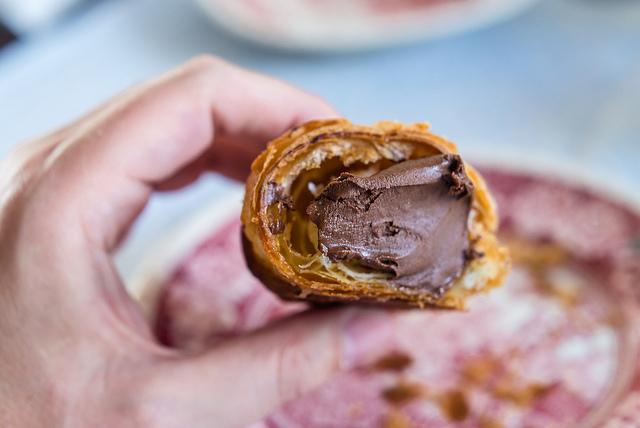
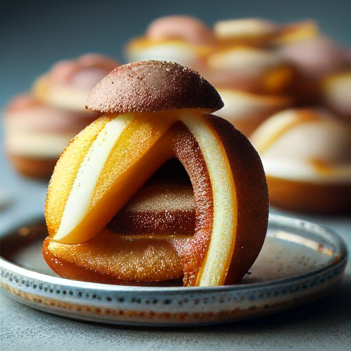
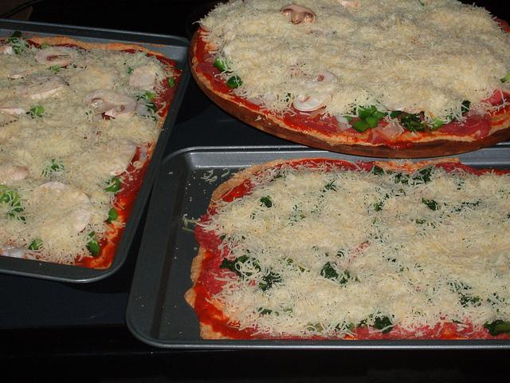
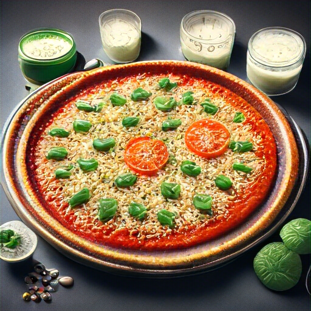

# Chameleon Model Doc for Align-Anything

## Environment setup

Currently, the official Transformer repo does not support Chameleon model with image output (see [this PR](https://github.com/huggingface/transformers/pull/32013) for more details), so we rely on a certain fork of the repo.

After installing Align-Anything and correctly set up the envrionment, you can install the forked stable version of the repo by running:

```bash
pip install git+https://github.com/htlou/transformers.git@hantao_stable_cham
```

## Model Download

We activate the image generation capability of the chameleon model and formed our base model. You can download the model from [here](https://huggingface.co/PKU-Alignment/AA-chameleon-7b-base), or directly use the model id `PKU-Alignment/AA-chameleon-7b-base` in the script.

Or, if you want to further train the model generated by our align_anything method, you can download the model from [here](https://huggingface.co/PKU-Alignment/AA-chameleon-7b-plus), or directly use the model id `PKU-Alignment/AA-chameleon-7b-plus` in the script.

## Model Training

As chameleon expands the \<image\> in the input into image placeholders (\<image\> * 1024) in the processor, but add the real image tokens inside the forward function, we need to do pretokenize to the input and merge the real image tokens to the labels before doing the training.

### Pre Tokenization

Set the input, output and Chameleon model path correctly in `pre_tokenize_example.py` and run:

```bash
python pre_tokenize_example.py
```

If you are dealing with a large dataset, you can use `pre_tokenize_parallel_example.py` to speed up the process in multiple threads:

```bash
python pre_tokenize_parallel_example.py
```

If you are dealing with prefernce dataset (for DPO or RM), you can use `preference_tokenize_example.py` to pre-tokenize the dataset:

```bash
python preference_tokenize_example.py
```

If you are dealing with prompt only dataset (for PPO), you can use `prompt_only_tokenize_example.py` to pre-tokenize the dataset:

```bash
python prompt_only_tokenize_example.py
```

### Model SFT

Add a script named `sft_text_image_to_text_image.sh` under the `scripts` file like this:

```bash
MODEL_NAME_OR_PATH=""
TRAIN_DATASETS="path/to/dataset"
PT_NAME="dataset_file_name"
OUTPUT_DIR="../outputs/sft_text_image_to_text_image"
export WANDB_API_KEY=""
source ./setup.sh

deepspeed \
	--master_port ${MASTER_PORT} \
	--module align_anything.trainers.text_image_to_text_image.sft \
	--model_name_or_path ${MODEL_NAME_OR_PATH} \
	--train_datasets ${TRAIN_DATASETS} \
	--train_data_files ${PT_NAME} \ 
	--output_dir ${OUTPUT_DIR} \
	--train_template ANYTHING_TI2TI \
	--train_split 'train' \
	--per_device_train_batch_size 2 \
	--per_device_eval_batch_size 2 \
	--gradient_accumulation_steps 2 \
	--save_interval 500 \
	--learning_rate 1e-5 \
	--epochs 12 \
    --lr_scheduler_type constant
```

and set up the correct model path and dataset path, then run:
    
```bash
bash scripts/sft_text_image_to_text_image.sh
```

### Model DPO


Add a script named `dpo_text_image_to_text_image.sh` under the `scripts` file like this:

```bash
MODEL_NAME_OR_PATH=""
TRAIN_DATASETS="path/to/dataset"
OUTPUT_DIR="../outputs/dpo_text_image_to_text_image"
PT_NAME="dataset_file_name"
export WANDB_API_KEY=""
source ./setup.sh

deepspeed \
	--master_port ${MASTER_PORT} \
	--module align_anything.trainers.text_image_to_text_image.dpo \
	--model_name_or_path ${MODEL_NAME_OR_PATH} \
	--train_datasets ${TRAIN_DATASETS} \
	--output_dir ${OUTPUT_DIR} \
	--per_device_train_batch_size 2 \
    --per_device_eval_batch_size 2 \
    --gradient_accumulation_steps 2 \
    --train_template ANYTHING_TI2TI \
    --train_split train \
	--train_data_files ${PT_NAME} \
	--learning_rate 5e-7 \
	--epochs 3 \
	--lr_scheduler_type cosine \
	--save_interval 2500 

```

and set up the correct model path and dataset path, then run:

```bash
bash scripts/dpo_text_image_to_text_image.sh
```

### Reward Model Training

Add a script named `rm_text_image_to_text_image.sh` under the `scripts` file like this:

```bash
MODEL_NAME_OR_PATH=""
TRAIN_DATASETS="path/to/dataset"
TRAIN_PT_NAME="dataset_file_name" 
EVAL_DATASETS="path/to/dataset"
EVAL_PT_NAME="dataset_file_name" 
OUTPUT_DIR="../outputs/rm_text_image_to_text_image"
export WANDB_API_KEY=""
source ./setup.sh

deepspeed \
	--master_port ${MASTER_PORT} \
	--module align_anything.trainers.text_image_to_text_image.rm \
	--model_name_or_path ${MODEL_NAME_OR_PATH} \
	--train_datasets ${TRAIN_DATASETS} \
	--output_dir ${OUTPUT_DIR} \
	--per_device_train_batch_size 2 \
    --per_device_eval_batch_size 2 \
    --gradient_accumulation_steps 2 \
    --train_template ANYTHING_TI2TI \
    --train_split train \
	--train_data_files ${TRAIN_PT_NAME} \
	--eval_datasets ${EVAL_DATASETS} \
	--eval_data_files ${EVAL_PT_NAME} \
	--eval_template ANYTHING_TI2TI \
	--learning_rate 5e-6 \
	--epochs 3 \
	--lr_scheduler_type cosine \
	--save_interval 2500 

```

and set up the correct model path and dataset path, then run:

```bash
bash scripts/rm_text_image_to_text_image.sh
```

### Model PPO

Add a script named `ppo_text_image_to_text_image.sh` under the `scripts` file like this:

```bash
ACTOR_MODEL_NAME_OR_PATH=""
CRITIC_MODEL_NAME_OR_PATH=""
REWARD_MODEL_NAME_OR_PATH=""
TRAIN_DATASETS=""
TRAIN_PT_NAME="dataset_file_name" 
PTX_DATASETS=""
PTX_PT_NAME="dataset_file_name" 
OUTPUT_DIR="../outputs/ppo_text_image_to_text_image"

source ./setup.sh

deepspeed \
  --master_port ${MASTER_PORT} \
  --module align_anything.trainers.text_image_to_text_image.ppo \
  --actor_model_name_or_path ${ACTOR_MODEL_NAME_OR_PATH} \
  --reward_model_name_or_path ${REWARD_MODEL_NAME_OR_PATH} \
  --reward_critic_model_name_or_path ${CRITIC_MODEL_NAME_OR_PATH} \
  --train_datasets ${TRAIN_DATASETS} \
  --train_template ANYTHING_TI2TI \
  --train_data_files ${TRAIN_PT_NAME} \
  --ptx_datasets ${PTX_DATASETS} \
  --ptx_data_files ${PTX_PT_NAME} \
  --ptx_template LLAVA \
  --output_dir ${OUTPUT_DIR}

```

and set up the correct model path and dataset path, then run:

```bash
bash scripts/ppo_text_image_to_text_image.sh
```

Note that current due to [a bug in transformers](https://github.com/huggingface/transformers/pull/32641), we can only support batch size of 1 for PPO.

## Model Evaluation

### Batch Inference

Currently the batch inference of Chameleon is not integrated into the Align-Anything repo, so we need to use [another repo](). Here's a forked (and revised to make it stable) version:

```bash
git clone https://github.com/htlou/mmsg_chameleon.git
cd mmsg_chameleon
```

Then set up the envrionment using 
```bash
pip install -e . 
```

After setting up the envrioment, set up the correct paths in `scripts/interleaved_gen.sh` and then run
```bash
bash scripts/interleaved_gen.sh
```

to do batch inference.

### GPT-based Evaluation

Currently the GPT-based evaluation of text-image interleaved messages is not integrated into the Align-Anything repo, so we need to use [another repo](https://github.com/htlou/gpt4_eval):

```bash
git clone https://github.com/htlou/gpt4_eval.git
cd gpt4_eval
```
You can set the `INPUT_TYPE` in the `script.sh` to `interleaved-compare` and run:
    
```bash
bash script.sh
```

to do the evaluation.

## Model Performance

We trained the lm_head of Chameleon-7B model using the full data from [laisonart](huggingface.co/datasets/fantasyfish/laion-art), and acquired a AA-Chameleon-7B model (AA refers to Align-Anything) with image generation capabilities. Then, we used our text-image interleaved input & output dataset (20k) to finetune this model, acquiring a AA-Chameleon-7B+, which is much better in text-image interleaved i/o task. The model is trained for 3 epochs with a batch size of 2 and a learning rate of 5e-05 (similar to meta's setting in [their paper](https://ai.meta.com/blog/generative-ai-text-images-cm3leon)). 

### GPT-4o evaluation

We compared the performance of AA-Chameleon-7B+ with Anole-7b model on a text-image interleaved i/o dataset (with a length of 500). Here's the results:

| win | lose | equal | win rate (not counting equal) |
|-------|-------|-------|-------| 
| 240 | 175 | 85 | 57.8% |

### Generation Examples

Example #1

Input text: Add a vintage filter to this bathroom image to give it a retro look and describe the steps involved in applying the filter. <image>
Input image: 

> Output text: <image>I have applied a vintage filter to the bathroom image to give it a retro look. The process involved adjusting the color temperature to add a slight cool tone, reducing the saturation to give it a more muted appearance, and increasing the contrast to enhance the vintage feel.

> Output image: 

Example #2

Input text: Create a detailed recipe for making the pastry shown in the image, including ingredients, preparation steps, and baking instructions. <image>

Input image: 

> Output text: <image>\n\nCooking Instructions:\n1. Preheat Oven: Preheat your oven to 350\u00b0F (175\u00b0C).\n2. Prepare Filling: In a small bowl, mix well the flour, sugar, eggs, and any other desired ingredients. To make it easier to handle, you can place the bowl of the mixture on a baking tray lined with parchment paper.\n3. Bake Donut: Place the prepared donut on the preheated baking tray. Bake for 8-10 minutes until the donut is golden brown and crispy on top.\n4. Cool and Serve: Allow the donut to cool slightly before serving. You can garnish it with a drizzle of chocolate sauce or caramel sauce if desired.\n\nEnjoy your homemade chocolate-filled donut!

> Output image: 

Example #3

Input text: Enhance the presentation of these pizzas with gourmet toppings and plating, and describe the steps involved. <image>

Input image: 

> Output text: <image>I have enhanced the presentation of the pizzas by adding gourmet toppings. The pizzas now feature fresh basil leaves, prosciutto, cherry tomatoes, shaved Parmesan cheese, and a drizzle of balsamic glaze. The toppings are arranged artistically on each pizza to create a visually appealing and gourmet presentation.

> Output image: 
